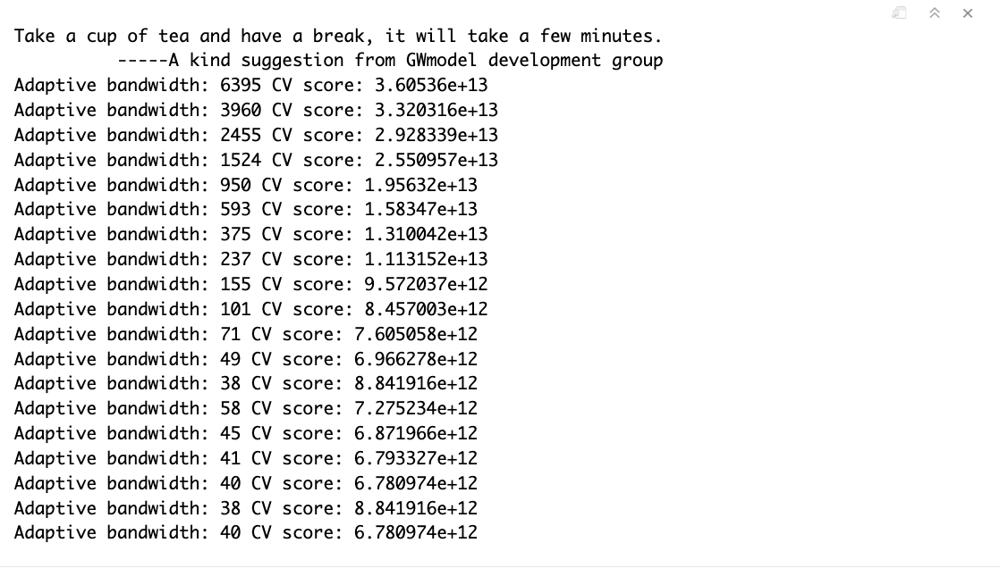
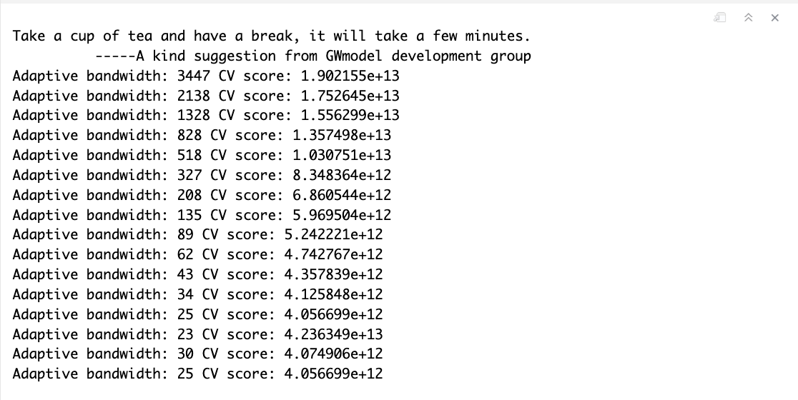
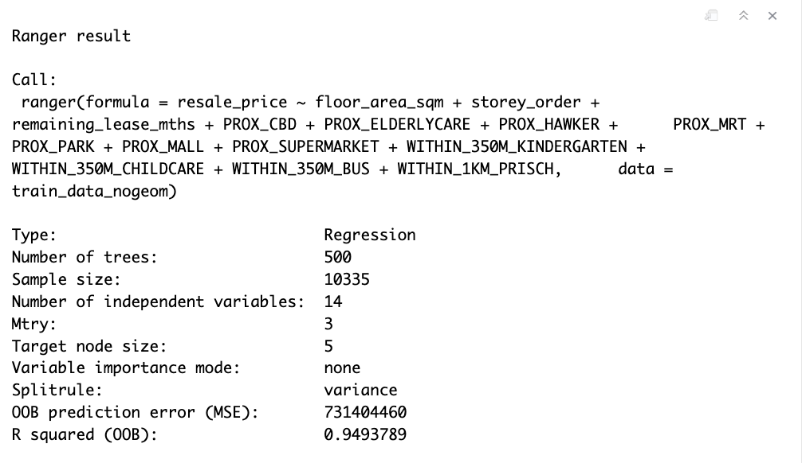
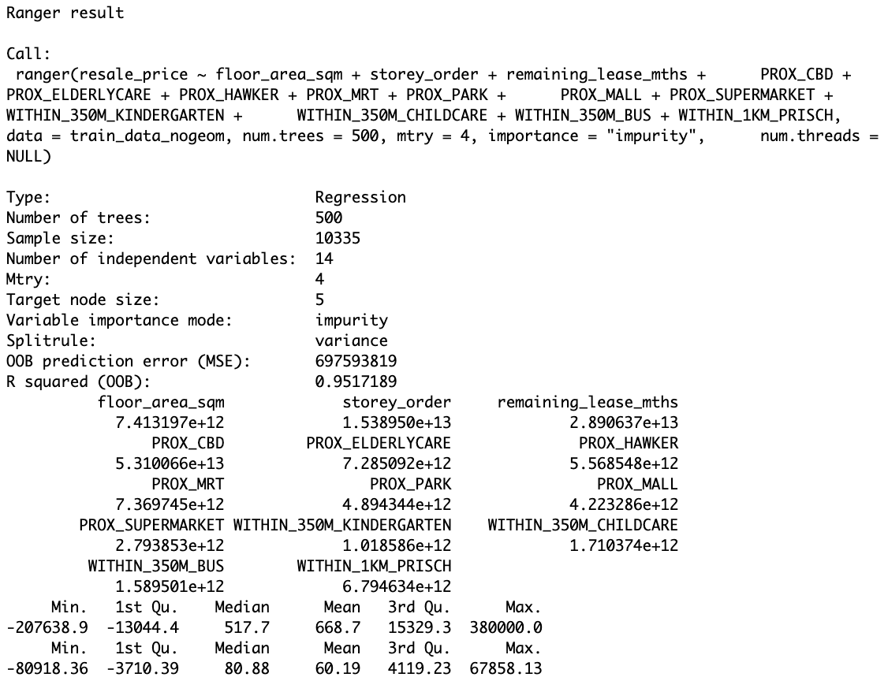

## **14.1 Overview**

This practical session focuses on developing predictive models using **geographically weighted methods** to forecast outcomes in spatial contexts. Unlike traditional statistical models that assume relationships are constant across space, geographically weighted approaches recognize that spatial patterns and relationships can vary from location to location.

The core principle is straightforward: when we analyze geographic data, events don't occur randomly across space. Physical infrastructure, social factors, topography, and other locational characteristics create patterns that influence where events happen. By incorporating spatial variation into our models, we can make more accurate predictions.

### **14.1.1 Learning outcome**

By completing this exercise, you will be able to:

-   preparing training and test data sets by using appropriate data sampling methods,

-   calibrating predictive models by using both geospatial statistical learning and machine learning methods,

-   comparing and selecting the best model for predicting the future outcome,

-   predicting the future outcomes by using the best model calibrated.

## **14.2 The Data**

Included:

-   **Aspatial dataset**:

    -   HDB Resale data: a list of HDB resale transacted prices in Singapore from Jan 2017 onwards. It is in csv format which can be downloaded from Data.gov.sg.

-   **Geospatial dataset**:

    -   *MP14_SUBZONE_WEB_PL*: a polygon feature data providing information of URA 2014 Master Plan Planning Subzone boundary data. It is in ESRI shapefile format. This data set was also downloaded from Data.gov.sg

-   **Locational factors with geographic coordinates**:

    -   Downloaded from **Data.gov.sg**.

        -   **Eldercare** data is a list of eldercare in Singapore. It is in shapefile format.

        -   **Hawker Centre** data is a list of hawker centres in Singapore. It is in geojson format.

        -   **Parks** data is a list of parks in Singapore. It is in geojson format.

        -   **Supermarket** data is a list of supermarkets in Singapore. It is in geojson format.

        -   **CHAS clinics** data is a list of CHAS clinics in Singapore. It is in geojson format.

        -   **Childcare service** data is a list of childcare services in Singapore. It is in geojson format.

        -   **Kindergartens** data is a list of kindergartens in Singapore. It is in geojson format.

    -   Downloaded from **Datamall.lta.gov.sg**.

        -   **MRT** data is a list of MRT/LRT stations in Singapore with the station names and codes. It is in shapefile format.

        -   **Bus stops** data is a list of bus stops in Singapore. It is in shapefile format.

-   **Locational factors without geographic coordinates**:

    -   Downloaded from **Data.gov.sg**.

        -   **Primary school** data is extracted from the list on General information of schools from data.gov portal. It is in csv format.

    -   Retrieved/Scraped from **other sources**

        -   **CBD** coordinates obtained from Google.

        -   **Shopping malls** data is a list of Shopping malls in Singapore obtained from [Wikipedia](https://en.wikipedia.org/wiki/List_of_shopping_malls_in_Singapore).

        -   **Good primary schools** is a list of primary schools that are ordered in ranking in terms of popularity and this can be found at [Local Salary Forum](https://www.salary.sg/2021/best-primary-schools-2021-by-popularity).

## **14.3 Installing and Loading R packages**

The code below accomplishes three tasks simultaneously:

1.  Creates a list of all required R packages

2.  Checks which packages are already installed and installs any missing ones

3.  Loads all packages into the current R session

```{r}
pacman::p_load(sf, spdep, GWmodel, SpatialML, tmap, rsample, Metrics, tidyverse)
```

## **14.4 Preparing Data**

### **14.4.1 Reading data file to rds**

Reading the input data sets. It is in simple feature data frame.

```{r}
mdata <- read_rds("data/rawdata/mdata.rds")
```

For efficiency, we'll work with data that has already been cleaned and feature-engineered. This preprocessed dataset is stored in RDS format (R Data Serialization), which preserves data structure and loads much faster than CSV files.

```{r}
set.seed(1234)
resale_split <- initial_split(mdata, 
                              prop = 6.5/10,)
train_data <- training(resale_split)
test_data <- testing(resale_split)
```

```{r}
#| eval: false
write_rds(train_data, "data/model/train_data.rds")
write_rds(test_data, "data/model/test_data.rds")
```

## **14.5 Computing Correlation Matrix**

Before loading the predictors into a predictive model, it is always a good practice to use correlation matrix to examine if there is sign of multicolinearity.

```{r}
#| fig-height: 10
#| fig-width: 12
mdata_nogeo <- mdata %>%
  st_drop_geometry()
corrplot::corrplot(cor(mdata_nogeo[, 2:17]), 
                   diag = FALSE, 
                   order = "AOE",
                   tl.pos = "td", 
                   tl.cex = 0.5, 
                   method = "number", 
                   type = "upper")
```

Correlations above 0.8 typically indicate problematic multicollinearity.

## **14.6 Retriving the Stored Data**

```{r}
train_data <- read_rds("data/model/train_data.rds")
test_data <- read_rds("data/model/test_data.rds")
```

## **14.7 Building a non-spatial multiple linear regression**

```{r}
price_mlr <- lm(resale_price ~ floor_area_sqm +
                  storey_order + remaining_lease_mths +
                  PROX_CBD + PROX_ELDERLYCARE + PROX_HAWKER +
                  PROX_MRT + PROX_PARK + PROX_MALL + 
                  PROX_SUPERMARKET + WITHIN_350M_KINDERGARTEN +
                  WITHIN_350M_CHILDCARE + WITHIN_350M_BUS +
                  WITHIN_1KM_PRISCH,
                data=train_data)
summary(price_mlr)
```

```{r}
#| eval: false
write_rds(price_mlr, "data/model/price_mlr.rds" ) 
```

## **14.8 gwr predictive method**

In this section, you will learn how to calibrate a model to predict HDB resale price by using geographically weighted regression method of [**GWmodel**](https://cran.r-project.org/web/packages/GWmodel/index.html) package.

### **14.8.1 Computing adaptive bandwidth**

Firstly, `bw.gwr()` of **GWmodel** package will be used to determine the optimal bandwidth to be used.

```{r}
#| eval: false
bw_adaptive <- bw.gwr(
  formula = resale_price ~ floor_area_sqm +
    storey_order + remaining_lease_mths +
    PROX_CBD + PROX_ELDERLYCARE + PROX_HAWKER +
    PROX_MRT + PROX_PARK + PROX_MALL + 
    PROX_SUPERMARKET + WITHIN_350M_KINDERGARTEN +
    WITHIN_350M_CHILDCARE + WITHIN_350M_BUS +
    WITHIN_1KM_PRISCH,
  data=train_data,
  approach="CV",
  kernel="gaussian",
  adaptive=TRUE,
  longlat=FALSE)

write_rds(bw_adaptive, "data/model/bw_adaptive.rds")
```

Save the output as an rds file for future used without have to re-run the process again.

{fig-align="center" width="532"}

The result shows that 40 neighbour points will be the optimal bandwidth to be used if adaptive bandwidth is used for this data set.

### **14.8.2 Constructing the adaptive bandwidth gwr model**

First, let us call the save bandwidth by using the code chunk below.

```{r}
bw_adaptive <- read_rds(
  "data/model/bw_adaptive.rds")
```

Now, we can go ahead to calibrate the gwr-based hedonic pricing model by using adaptive bandwidth and Gaussian kernel as shown in the code chunk below.

```{r}
#| eval: false
gwr_adaptive <- gwr.basic(
  formula = resale_price ~ floor_area_sqm +
    storey_order + remaining_lease_mths + 
    PROX_CBD + PROX_ELDERLYCARE + 
    PROX_HAWKER + PROX_MRT + PROX_PARK + 
    PROX_MALL + PROX_SUPERMARKET +
    WITHIN_350M_KINDERGARTEN +
    WITHIN_350M_CHILDCARE + 
    WITHIN_350M_BUS + WITHIN_1KM_PRISCH,
  data=train_data,
  bw=bw_adaptive, 
  kernel = 'gaussian', 
  adaptive=TRUE,
  longlat = FALSE)

write_rds(gwr_adaptive, 
          "data/model/gwr_adaptive.rds")
```

### **14.8.3 Retrieve gwr output object**

Repeat the step:

The code chunk below will be used to retrieve the save gwr model object.

```{r}
gwr_adaptive <- read_rds("data/model/gwr_adaptive.rds")
```

The code below can be used to display the model output.

```{r}
gwr_adaptive
```

### **14.8.4 Computing adaptive bandwidth for the test data**

```{r}
#| eval: false
gwr_bw_test_adaptive <- bw.gwr(
  formula = resale_price ~ floor_area_sqm +
    storey_order + remaining_lease_mths +
    PROX_CBD + PROX_ELDERLYCARE + PROX_HAWKER +
    PROX_MRT + PROX_PARK + PROX_MALL + 
    PROX_SUPERMARKET + WITHIN_350M_KINDERGARTEN +
    WITHIN_350M_CHILDCARE + WITHIN_350M_BUS +
    WITHIN_1KM_PRISCH,
  data=test_data,
  approach="CV",
  kernel="gaussian",
  adaptive=TRUE,
  longlat=FALSE)

write_rds(gwr_bw_test_adaptive, 
          "data/model/gwr_bw_test_adaptive.rds")
```

{fig-align="center" width="649"}

### **14.8.5 Computing predicted values of the test data**

```{r}
#| eval: false
gwr_pred <- gwr.predict(
  formula = resale_price ~ floor_area_sqm + 
    storey_order + remaining_lease_mths + 
    PROX_CBD + PROX_ELDERLYCARE + PROX_HAWKER + 
    PROX_MRT + PROX_PARK + PROX_MALL + 
    PROX_SUPERMARKET + WITHIN_350M_KINDERGARTEN +
    WITHIN_350M_CHILDCARE + WITHIN_350M_BUS + 
    WITHIN_1KM_PRISCH, 
  data=train_data, 
  predictdata = test_data, 
  bw=40, 
  kernel = 'gaussian', 
  adaptive=TRUE, 
  longlat = FALSE)

write_rds(gwr_pred, 
          "data/model/gwr_pred.rds")
```

## **14.9 Calibrating Random Forest Model**

In this section, you will learn how to calibrate a model to predict HDB resale price by using random forest function of [**ranger**](https://cran.r-project.org/web/packages/ranger/index.html) package.

### **14.9.1 Preparing coordinates data**

The code chunk below extract the x,y coordinates of the full, training and test data sets.

```{r}
coords <- st_coordinates(mdata)
coords_train <- st_coordinates(train_data)
coords_test <- st_coordinates(test_data)
```

Before continue, we write all the output into rds for future used.

```{r}
#| eval: false
coords_train <- write_rds(
  coords_train, 
  "data/model/coords_train.rds" )
coords_test <- write_rds(
  coords_test, 
  "data/model/coords_test.rds" )
```

### **14.9.2 Droping geometry field**

First, we will drop geometry column of the sf data.frame by using `st_drop_geometry()` of sf package.

```{r}
train_data_nogeom <- train_data %>% 
  st_drop_geometry()

test_data_nogeom <- test_data %>% 
  st_drop_geometry()
```

### **14.9.3 Calibrating a non-spatial random forest model**

```{r}
set.seed(1234)
rf <- ranger(
  formula = resale_price ~ floor_area_sqm +
    storey_order + remaining_lease_mths + 
    PROX_CBD + PROX_ELDERLYCARE + 
    PROX_HAWKER + PROX_MRT + PROX_PARK + 
    PROX_MALL + PROX_SUPERMARKET +
    WITHIN_350M_KINDERGARTEN + 
    WITHIN_350M_CHILDCARE + 
    WITHIN_350M_BUS +  
    WITHIN_1KM_PRISCH,
  data=train_data_nogeom)
rf
```



```{r}
#| eval: false
write_rds(rf, "data/model/rf.rds")
```

## **14.10 Calibrating Geographical Weighted Random Forest Model**

In this section, you will learn how to calibrate a model to predict HDB resale price by using `grf()`of [**SpatialML**](https://cran.r-project.org/web/packages/ranger/index.html) package.

### **14.10.1 Calibrating using training data**

The code chunk below calibrate a geographic ranform forest model by using `grf()` of **SpatialML**package.

```{r}
#| eval: false
set.seed(1234)
gwRF_adaptive <- grf(
  formula = resale_price ~ floor_area_sqm +
    storey_order + remaining_lease_mths + 
    PROX_CBD + PROX_ELDERLYCARE + 
    PROX_HAWKER + PROX_MRT + PROX_PARK + 
    PROX_MALL + PROX_SUPERMARKET +
    WITHIN_350M_KINDERGARTEN +
    WITHIN_350M_CHILDCARE + 
    WITHIN_350M_BUS + WITHIN_1KM_PRISCH,
  dframe=train_data_nogeom, 
  bw=40,
  kernel="adaptive",
  coords=coords_train)

write_rds(gwRF_adaptive, "data/model/gwRF_adaptive.rds")
```



Save the results:

```{r}
#| eval: false
gwRF_adaptive <- read_rds("data/model/gwRF_adaptive.rds")
```

### **14.10.2 Predicting by using test data**

#### 14.10.2.1 Preparing the test data

The code chunk below will be used to combine the test data with its corresponding coordinates data.

```{r}
test_data_nogeom <- cbind(
  test_data, coords_test) %>%
  st_drop_geometry()
```

#### 14.10.2.2 Predicting with test data

Next, `predict.grf()` of spatialML package will be used to predict the resale value by using the test data and gwRF_adaptive model calibrated earlier.

```{r}
#| eval: false
gwRF_pred <- predict.grf(gwRF_adaptive, 
                           test_data_nogeom, 
                           x.var.name="X",
                           y.var.name="Y", 
                           local.w=1,
                           global.w=0)

GRF_pred <- write_rds(gwRF_pred, "data/model/GRF_pred.rds")
```

#### 14.10.2.3 Converting the predicting output into a data frame

The output of the `predict.grf()` is a vector of predicted values. It is wiser to convert it into a data frame for further visualisation and analysis.

```{r}
GRF_pred <- read_rds(
  "data/model/GRF_pred.rds")
GRF_pred_df <- as.data.frame(GRF_pred)
```

In the code chunk below, `cbind()` is used to append the predicted values onto test_datathe

```{r}
test_data_p <- cbind(
  test_data, GRF_pred_df) %>%
  select(resale_price, GRF_pred)
```

```{r}
#| eval: false
write_rds(test_data_p, 
          "data/model/test_data_p.rds")
```

### **14.10.3 Calculating Root Mean Square Error**

The root mean square error (RMSE) allows us to measure how far predicted values are from observed values in a regression analysis. In the code chunk below, rmse() of Metrics package is used to compute the RMSE.

```{r}
rmse(test_data_p$resale_price, 
     test_data_p$GRF_pred)
```

### **14.10.4 Visualising the predicted values**

Alternatively, scatterplot can be used to visualise the actual resale price and the predicted resale price by using the code chunk below.

```{r}
ggplot(data = test_data_p,
       aes(x = GRF_pred,
           y = resale_price)) +
  geom_point()
```

-   Excellent performance in lower to mid-price ranges (S\$200K-S\$700K), showing minimal prediction errors

-   Slight degradation at higher price points (\>S\$800K), with increased scatter suggesting the model struggles with premium properties

-   No systematic bias - points distribute symmetrically around the diagonal, indicating balanced predictions without consistent over- or under-valuation

-   Few outliers above S\$1M suggest unique property characteristics not fully captured by spatial and structural predictors
