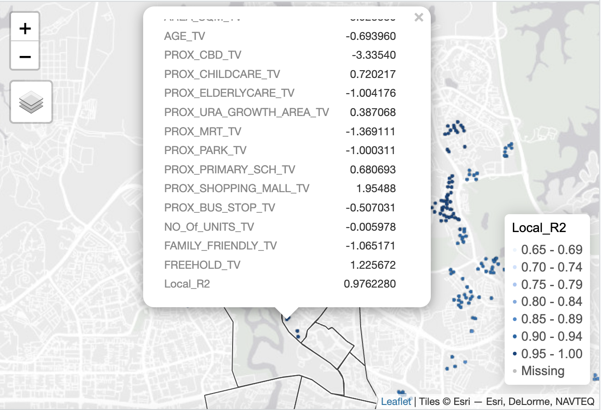

The code chunks below installs and launches these R packages into R environment.

```{r}
pacman::p_load(olsrr, corrplot, ggpubr, 
               sf, sfdep, GWmodel, tmap, 
               tidyverse, gtsummary,
               performance, RColorBrewer)
```

### **Importing geospatial data**

```{r}
mpsz = st_read(dsn = "data/geospatial", 
               layer = "MP14_SUBZONE_WEB_PL")
```

```{r}
mpsz_svy21 <- st_transform(mpsz, 3414)
```

### **Importing the aspatial data**

```{r}
condo_resale = read_csv(
  "data/aspatial/Condo_resale_2015.csv")
```

Check the data structure:

```{r}
glimpse(condo_resale)
```

## **Building Hedonic Pricing Models using GWmodel**

### Computing fixed bandwith

```{r}
condo_resale.sf <- st_as_sf(condo_resale,
                            coords = c("LONGITUDE", "LATITUDE"),
                            crs=4326) %>%
  st_transform(crs=3414)
```

```{r}
bw.fixed <- bw.gwr(
  formula = SELLING_PRICE ~ AREA_SQM + AGE  + 
    PROX_CBD + PROX_CHILDCARE + PROX_ELDERLYCARE    +
    PROX_URA_GROWTH_AREA + PROX_MRT + PROX_PARK + 
    PROX_PRIMARY_SCH + PROX_SHOPPING_MALL   + 
    PROX_BUS_STOP   + NO_Of_UNITS + FAMILY_FRIENDLY + 
    FREEHOLD, 
  data=condo_resale.sf, 
  approach="AICc", 
  kernel="gaussian", 
  adaptive=FALSE, 
  longlat=FALSE)
```

#### GWModel method - fixed bandwith

Now we can use the code chunk below to calibrate the gwr model using fixed bandwidth and gaussian kernel.

```{r}
gwr.fixed <- gwr.basic(
  formula = SELLING_PRICE ~ AREA_SQM + AGE  + 
    PROX_CBD + PROX_CHILDCARE + PROX_ELDERLYCARE    +
    PROX_URA_GROWTH_AREA + PROX_MRT + PROX_PARK +
    PROX_PRIMARY_SCH + PROX_SHOPPING_MALL   + 
    PROX_BUS_STOP   + NO_Of_UNITS + FAMILY_FRIENDLY + 
    FREEHOLD, 
  data=condo_resale.sf, 
  bw=bw.fixed, 
  kernel = 'gaussian', 
  longlat = FALSE)
```

The output is saved in a list of class “gwrm”. The code below can be used to display the model output.

```{r}
gwr.fixed
```

The report shows that the AICc of the gwr is 42263.61 which is significantly smaller than the globel multiple linear regression model of 42967.1.

### **Building Adaptive Bandwidth GWR Model**

In this section, we will calibrate the gwr-based hedonic pricing model by using adaptive bandwidth approach.

#### Computing the adaptive bandwidth

Similar to the earlier section, we will first use `bw.gwr()` to determine the recommended data point to use.

The code chunk used look very similar to the one used to compute the fixed bandwidth except the `adaptive` argument has changed to **TRUE**.

```{r}
bw.adaptive <- bw.gwr(
  formula = SELLING_PRICE ~ AREA_SQM + AGE  + 
    PROX_CBD + PROX_CHILDCARE + PROX_ELDERLYCARE    +
    PROX_URA_GROWTH_AREA + PROX_MRT + PROX_PARK +
    PROX_PRIMARY_SCH + PROX_SHOPPING_MALL   + 
    PROX_BUS_STOP   + NO_Of_UNITS + 
    FAMILY_FRIENDLY + FREEHOLD, 
  data=condo_resale.sf, 
  approach="CV", 
  kernel="gaussian", 
  adaptive=TRUE, 
  longlat=FALSE)
```

The result shows that the 30 is the recommended data points to be used.

#### Constructing the adaptive bandwidth gwr model

Now, we can go ahead to calibrate the gwr-based hedonic pricing model by using adaptive bandwidth and gaussian kernel as shown in the code chunk below.

```{r}
gwr.adaptive <- gwr.basic(
  formula = SELLING_PRICE ~ AREA_SQM + AGE + 
    PROX_CBD + PROX_CHILDCARE + PROX_ELDERLYCARE +
    PROX_URA_GROWTH_AREA + PROX_MRT + PROX_PARK +
    PROX_PRIMARY_SCH + PROX_SHOPPING_MALL + PROX_BUS_STOP +
    NO_Of_UNITS + FAMILY_FRIENDLY + FREEHOLD,
  data=condo_resale.sf, 
  bw=bw.adaptive, 
  kernel = 'gaussian', 
  adaptive=TRUE, 
  longlat = FALSE)
```

The code below can be used to display the model output.

```{r}
gwr.adaptive
```

The report shows that the AICc the adaptive distance gwr is 41982.22 which is even smaller than the AICc of the fixed distance gwr of 42263.61.

```{r}
condo_resale.sf.adaptive <-
  st_as_sf(gwr.adaptive$SDF) %>%
  st_transform(crs=3414)
```

```{r}
glimpse(condo_resale.sf.adaptive)
```

```{r}
summary(gwr.adaptive$SDF$yhat)
```

```{r}
#| eval: false
jurong <- mpsz_svy21 %>%
filter(grepl("JURONG EAST", PLN_AREA_N, ignore.case = TRUE))

tmap_mode("view")
tm_shape(jurong)+
  tm_polygons(fill_alpha = 0.1) +
tm_shape(condo_resale.sf.adaptive) +  
  tm_dots(col = "Local_R2",
          border.col = "gray60",
          border.lwd = 1) +
  tm_view(set.zoom.limits = c(11,14))

tmap_mode("plot")
```

](images/clipboard-2162894042.png)

Adaptive GWR fits Jurong East well: bandwidth varies by density, capturing local effects. Local R square is mostly ≥0.80, some near 1.0 it's look great. Lower AICc implies better generalization.
