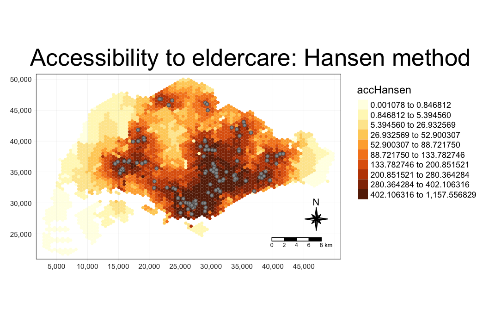
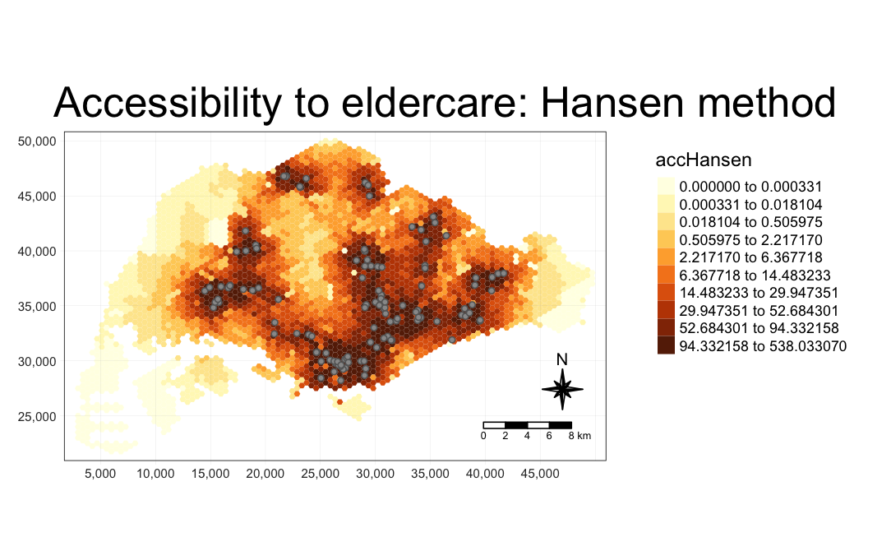
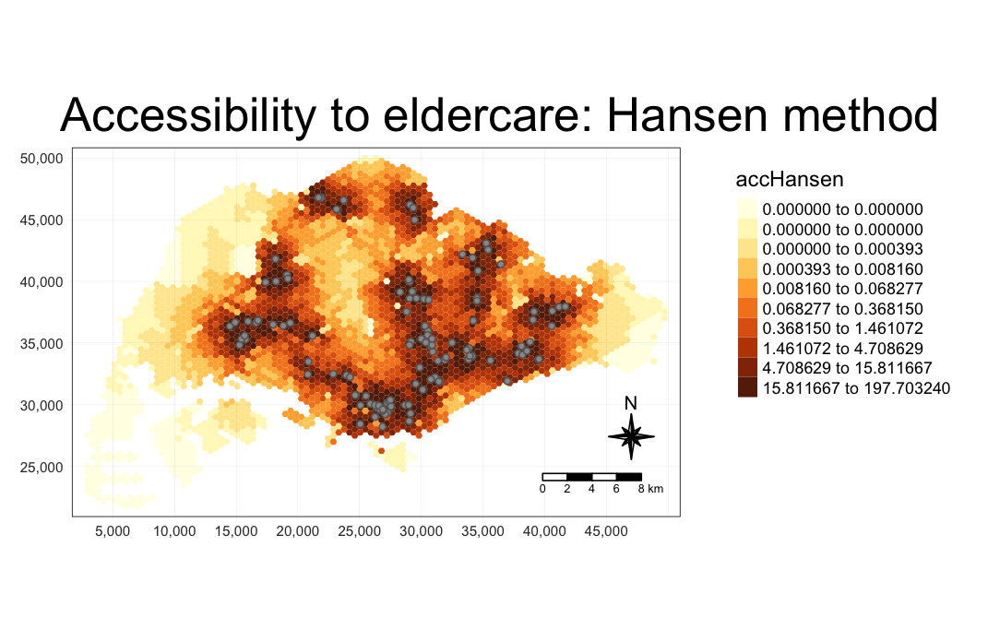
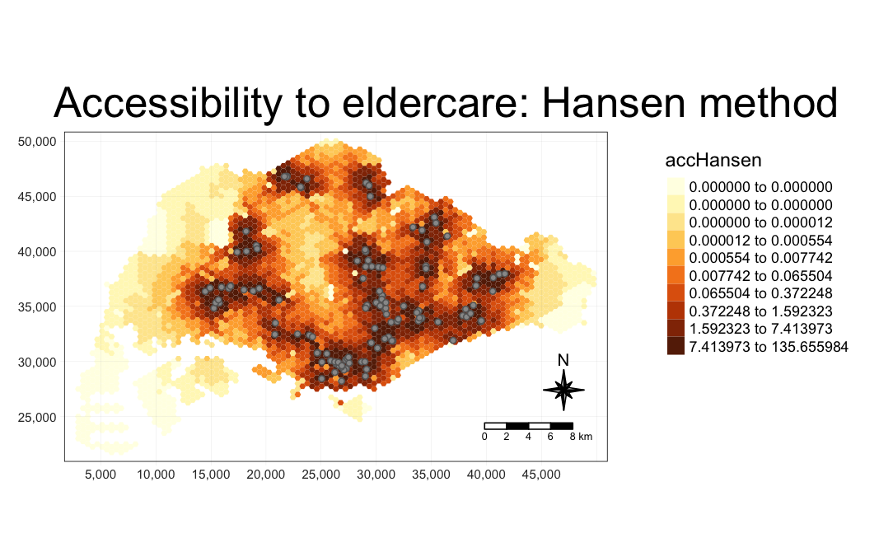

## **Getting Started**

```{r}
pacman::p_load(SpatialAcc, sf, tidyverse, 
               tmap, ggstatsplot)
```

## **Count Number of Points within a Distance**

```{r}
eldercare <- st_read(dsn = "data/rawdata",
                     layer = "ELDERCARE") %>%
  st_transform(crs = 3414)
```

```{r}
CHAS <- st_read("data/rawdata/CHASClinics.kml") %>%
  st_transform(crs = 3414)
```

```{r}
buffer_1km <- st_buffer(eldercare, 
                        dist = 1000)
```

```{r}
tmap_mode("view")
tm_shape(buffer_1km) +
  tm_polygons() +
tm_shape(CHAS) +
  tm_dots()
```

```{r}
buffer_1km$pts_count <- lengths(
  st_intersects(buffer_1km, CHAS))
```

## **Importing Data**

```{r}
mpsz <- st_read(dsn = "data/geospatial",
                layer = "MP14_SUBZONE_NO_SEA_PL") %>%
  st_transform(crs = 3414)

hexagons <- st_read(dsn = "data/geospatial",
                   layer = "hexagons") %>%
  st_transform(crs = 3414)

eldercare <- st_read(dsn = "data/geospatial",
                     layer = "ELDERCARE") %>%
  st_transform(crs = 3414)
```

```{r}
ODMatrix <- read_csv("data/aspatial/OD_Matrix.csv", 
                     skip = 0)
```

## **Data cleaning and Updating Attributes**

```{r}
eldercare <- eldercare %>%
  select(fid, ADDRESSPOS) %>%
  mutate(capacity = 100)
```

```{r}
hexagons <- hexagons %>%
  select(fid) %>%
  mutate(demand = 100)
```

```{r}
distmat <- ODMatrix %>%
  select(origin_id, destination_id, total_cost) %>%
  spread(destination_id, total_cost)%>%
  select(c(-c('origin_id')))
```

```{r}
distmat_km <- as.matrix(distmat/1000)
```

## **Computing Handsen’s Accessibility**

```{r}
acc_Hansen <- data.frame(ac(hexagons$demand,
                            eldercare$capacity,
                            distmat_km, 
                            #d0 = 50,
                            power = 2, 
                            family = "Hansen"))
```

```{r}
colnames(acc_Hansen) <- "accHansen"

acc_Hansen <- as_tibble(acc_Hansen)

hexagon_Hansen <- bind_cols(hexagons, acc_Hansen)
```

```{r}
acc_Hansen <- data.frame(ac(hexagons$demand,
                            eldercare$capacity,
                            distmat_km, 
                            #d0 = 50,
                            power = 0.5, 
                            family = "Hansen"))

colnames(acc_Hansen) <- "accHansen"
acc_Hansen <- as_tibble(acc_Hansen)
hexagon_Hansen <- bind_cols(hexagons, acc_Hansen)
```

### **Visualising Accessibility**

```{r}
mapex <- st_bbox(hexagons)

tmap_mode("plot")
tm_shape(hexagon_Hansen,
         bbox = mapex) + 
  tm_fill(col = "accHansen",
          n = 10,
          style = "quantile",
          border.col = "black",
          border.lwd = 1) +
tm_shape(eldercare) +
  tm_symbols(size = 0.1) +
  tm_layout(main.title = "Accessibility to eldercare: Hansen method",
            main.title.position = "center",
            main.title.size = 2,
            legend.outside =TRUE,
            legend.height = 0.45, 
            legend.width = 3.0,
            legend.format = list(digits = 6),
            legend.position = c("right", "top"),
            frame = TRUE) +
  tm_compass(type="8star", size = 2) +
  tm_scale_bar(width = 0.15) +
  tm_grid(lwd = 0.1, alpha = 0.5)
```

## Observations

Looking at the values in the legend across the five maps, we can see that as power increases from 0.5 to 2.5, the maximum accessibility scores decrease quickly, while scores in areas with low accessibility drop rapidly to zero. This reflects the intensification of the distance effects: as the power value increases, the contribution of distant facilities to accessibility decreases.

-   **Power=0.5**



-   **Power=1.0**



-   **Power=1.5**

    

<!-- -->

-   **Power=2.0**



-   **Power=2.5**



### **Statistical graphic**

```{r}
hexagon_Hansen <- st_join(hexagon_Hansen, mpsz, 
                          join = st_intersects)
```

```{r}
ggbetweenstats(
  data = hexagon_Hansen,
  x = REGION_N,
  y = accHansen,
  type = "p")
```
