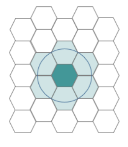
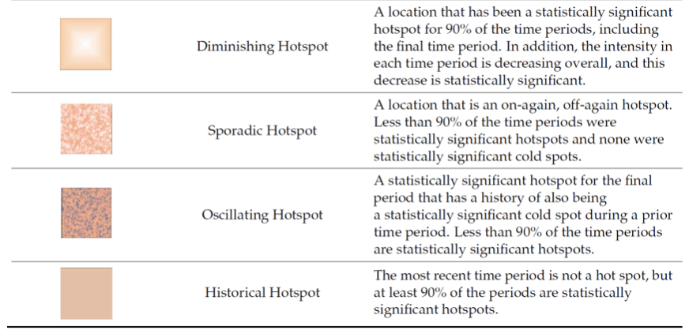
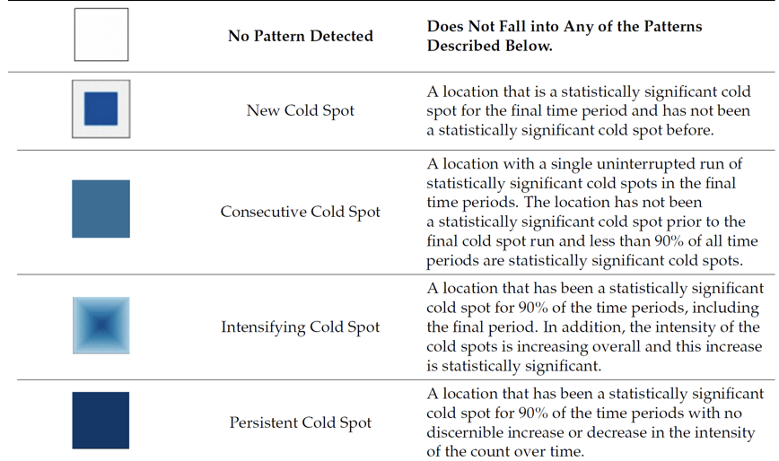
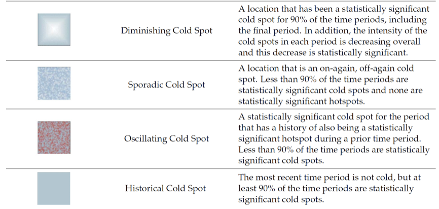

## 1. Introduction

Buses stitch a city together. Every weekday morning, streams of commuters converge on workplaces and schools. In the evenings and at weekends, however, people disperse to shop, visit friends and family, or relax. Thanks to smartcard ticketing and GPS enabled fleets, we now have detailed records of these everyday movements, showing not only where people travel, but also when these patterns surge, fade or shift across neighborhoods. In practice, however, such rich data are often flattened into static maps or single summary numbers, which can obscure important local differences and conceal changes as they unfold. This study looks beyond the averages. Using bus origin–destination passenger volumes from the LTA DataMall, we address two fundamental yet practical questions:

1.  How do bus mobility patterns differ across neighborhoods?

2.  What emerging patterns are taking shape, that could help planners to anticipate commuting demand and design more responsive services and policies?

The study's aim is to turn raw movement traces into grounded insights and highlight where targeted capacity adjustments could improve everyday journeys, where persistent gaps may require structural solutions and where time-bound surges necessitate flexible interventions. In short, our aim is to provide a clear neighborhood level view of how bus demand actually behaves, and to use emerging models for detecting urban mobility to help planners predict commuting demand and design more responsive public transport services and policies.

## 2. Loading the R package

```{r}
pacman::p_load(sf,sfdep,tmap,tidyverse,plotly,Kendall,knitr,lubridate,dplyr,sf,tidyr,spdep,ggplot2,scales)
```

## 3. Data Preparation

### 3.1 Import data

-   **Master Plan 2019 Subzone boundaries:**

The Master Plan 2019 Subzone Boundary dataset is from URA Master Plan 2019 Subzone Boundary (KML/Shape). We reproject all geospatial layers to Singapore’s projected CRS **SVY21 / EPSG:3414**, so that distances and areas are expressed in **metres** and are therefore appropriate for density, contiguity, and LMSA computations.

```{r}
mpsz = read_rds("data/mpsz_sf.rds")
```

-   **Bus Stop Location:**

From LTA Bus Stop locations (CSV/GeoJSON) with WGS 84 latitude/longitude.

```{r}
BusStop = st_read(dsn = "data/geospatial/LTADataMall/", 
                  layer = "BusStop") %>%
  st_transform(crs = 3414)
```

-   **Odbus Data:**

LTA DataMall “Passenger Volume by Origin Destination Bus Stops” (2025.07 - 2025.09).

```{r}
odbus <- read_csv("data/aspatial/origin_destination_bus_2025Q3_merged.csv")
```

### 3.2 Data review and processing

-   **mpsz**

```{r}
glimpse(mpsz)
```

-   **Bus Stop**

```{r}
glimpse(BusStop)
head(BusStop,3)
```

```{r}
cat("Total records:", nrow(BusStop), "\n")
cat("Unique BUS_STOP_N:", n_distinct(BusStop$BUS_STOP_N), "\n")
cat("Missing BUS_STOP_N:", sum(is.na(BusStop$BUS_STOP_N)), "\n")
cat("BUS_STOP_N type:", class(BusStop$BUS_STOP_N), "\n")
```

Before joining with trips, we audited the key to prevent mismatches. Total record has **5,172** rows, but only **5,154** **unique** `BUS_STOP_N`, so some codes were duplicates. Let's list the duplicated codes.

```{r}
dup_bus_stop_n <- BusStop %>%
  st_drop_geometry() %>%
  count(BUS_STOP_N, sort = TRUE) %>%
  filter(n > 1)

head(dup_bus_stop_n)
```

When I search those `BUS_STOP_N` ,only have one record,these duplicates are most likely repeated records. Therefore, we keep one record per code, standardize `BUS_STOP_N` to 5-digit and remove messy rows.

{fig-align="center" width="241"}

```{r}
BusStop <- BusStop %>%
  mutate(orig = as.character(BUS_STOP_N),LOC_DESC = na_if(LOC_DESC, "")) %>%
  filter(!(str_detect(orig, "[A-Za-z]") & (is.na(LOC_DESC) | LOC_DESC == "000"))) %>%
  mutate(BUS_STOP_N = str_pad(str_extract(orig, "\\d+"), 5, pad = "0")) %>%
  filter(str_detect(BUS_STOP_N, "^\\d{5}$")) %>%
  distinct(BUS_STOP_N, .keep_all = TRUE) %>%
  select(-orig)

cat("After cleaning:", nrow(BusStop), "records\n")
cat("All codes are 5-digit:", all(nchar(BusStop$BUS_STOP_N) == 5), "\n")
```

-   **Odbus:**

```{r}
anyNA(odbus)
dplyr::glimpse(odbus) 
```

We can see that there are no missing values now. For later work reliable, we’ll check the code of `ORIGIN_PT_CODE`and `DESTINATION_PT_CODE` and standardize avoid messy.

## 5. Data Classification and Aggregation

### 5.1 Time Period Classification

We use **DAY_TYPE** to separate weekdays from weekends/holidays, and **TIME_PER_HOUR** to define the time windows for the subsequent analysis.

```{r}
odbus_classified <- odbus %>%
  mutate(
    TIME_PERIOD = case_when(
      DAY_TYPE == "WEEKDAY" & TIME_PER_HOUR %in% 6:9  ~ "Weekday_Morning",
      DAY_TYPE == "WEEKDAY" & TIME_PER_HOUR %in% 17:20 ~ "Weekday_Afternoon",
      DAY_TYPE %in% c("WEEKENDS/HOLIDAY") & TIME_PER_HOUR %in% 11:20 ~ "Weekend_Holiday",
      TRUE ~ "Other")) %>%
  filter(TIME_PERIOD != "Other") %>%
  mutate(
    ORIGIN_PT_CODE = str_pad(str_extract(as.character(ORIGIN_PT_CODE), "\\d+"), 5, pad = "0"),
    DESTINATION_PT_CODE = str_pad(str_extract(as.character(DESTINATION_PT_CODE), "\\d+"), 5, pad = "0"))
```

```{r}
all(stringr::str_detect(odbus_classified$ORIGIN_PT_CODE, "^\\d{5}$"))
all(stringr::str_detect(odbus_classified$DESTINATION_PT_CODE, "^\\d{5}$"))
```

```{r}
table(odbus_classified$TIME_PERIOD, odbus_classified$YEAR_MONTH)
```

### 5.2 Aggregating by Origin

```{r}
trips_origin <- odbus_classified %>%
  group_by(ORIGIN_PT_CODE, YEAR_MONTH, TIME_PERIOD) %>%
  summarise(TOTAL_TRIPS = sum(TOTAL_TRIPS, na.rm = TRUE), .groups = 'drop') %>%
  rename(BUS_STOP_CODE = ORIGIN_PT_CODE)
```

```{r}
summary(trips_origin$TOTAL_TRIPS)
```

## 6. Creating Hexagonal Grid (375m)

### **6.1 Creating the Grid**

We first generate a 375m equal area hexagonal grid in SVY21, clip it to the mainland boundary, and assign `HEX_ID`. This grid aggregates origin trips and supports subsequent LMSA/EHSA analyses.

```{r}
hexagon_sg <- st_make_grid(mpsz, cellsize = 750,what = "polygons",square = FALSE) %>%
  st_sf() %>%
  mutate(HEX_ID = sprintf("H%04d", row_number()))
```

Checking the hexagon layer visually:

```{r}
land_sg <- st_union(mpsz)
hex_main <- st_intersection(hexagon_sg, land_sg)
tm_shape(land_sg) +
  tm_polygons(fill = "white", col = "black", lwd = 0.6) +
tm_shape(hex_main) +
  tm_borders(col = "black", lwd = 0.3) +
tm_title("Hexagonal Grid (375m) — Singapore Mainland") +
tm_layout(frame = TRUE, bg.color = "white")

tmap_mode("plot")
```

### 6.2 Filtering to Relevant Hexagons

Keep only hexagons that intersect at least one bus stop for visualizing.

```{r}
BusStop_sg <- st_join(BusStop, mpsz, join = st_within, left = FALSE)
hexagon_with_stops <- hexagon_sg[
  lengths(st_intersects(hexagon_sg, BusStop_sg)) > 0, ]
```

```{r}
cat("Bus stops in mainland:", nrow(BusStop_sg), "\n")
cat("Hexagons with stops:", nrow(hexagon_with_stops), "\n")
```

### **6.3 Visualizing the hexagon layer**

Quick check: plot the hexagon over the mainland and drop the bus stops on top.

```{r}
land_sg <- st_union(mpsz)
tm_shape(land_sg) +
  tm_polygons(fill = "white", col = "black", lwd = 0.6) +
tm_shape(hexagon_with_stops) +
  tm_borders(col = "black", lwd = 0.3) +
tm_shape(BusStop_sg) +
  tm_dots(fill = "black", size = 0.03, alpha = 0.5) +
  tm_layout(
    main.title = "Hexagonal Grid (375m) with Bus Stops",
    frame = TRUE) +
  tm_compass(type = "8star", size = 2) +
  tm_scale_bar()

tmap_mode("plot")
```

## 7. Aggregating Trips to Hexagons

### 7.1 Spatial Join

Assign bus stops to hexagons.

```{r}
BusStop_hex <- st_join(BusStop_sg, hexagon_with_stops %>% select(HEX_ID), 
                       join = st_within) %>% group_by(BUS_STOP_N) %>% slice(1) %>% ungroup()
```

```{r}
cat("Bus stops assigned to hexagons:", nrow(BusStop_hex), "\n")
```

### 7.2 Join Trips with Hexagons

Match origin-trip records to those hexagon ID via Bus Stop code.

```{r}
trips_hex <- trips_origin %>%
  left_join(
    BusStop_hex %>% st_drop_geometry() %>% select(BUS_STOP_N, HEX_ID),
    by = c("BUS_STOP_CODE" = "BUS_STOP_N")) %>%
  filter(!is.na(HEX_ID))

cat("Trip records matched:", nrow(trips_hex), "\n")
cat("Match rate:", sprintf("%.1f%%\n", nrow(trips_hex)/nrow(trips_origin)*100))
```

### 7.3 Aggregate to Hexagon Level

Aggregate origin trips by **HEX_ID × month × period** to get `TOTAL_TRIPS` per hex.

```{r}
trips_hex_agg <- trips_hex %>%
  group_by(HEX_ID, YEAR_MONTH, TIME_PERIOD) %>%
  summarise(TOTAL_TRIPS = sum(TOTAL_TRIPS, na.rm = TRUE), .groups = 'drop')

head(trips_hex_agg, 10)
summary(trips_hex_agg$TOTAL_TRIPS)
```

## 8. Exploratory Data Analysis

### 8.1 Distribution by Time Period

```{r}
summary_table <- trips_hex_agg %>%
  group_by(YEAR_MONTH, TIME_PERIOD) %>%
  summarise(
    Mean = mean(TOTAL_TRIPS),
    Median = median(TOTAL_TRIPS),
    SD = sd(TOTAL_TRIPS),
    Min = min(TOTAL_TRIPS),
    Max = max(TOTAL_TRIPS),
    .groups = 'drop'
  )

kable(summary_table, digits = 1)
```

### 8.2 **EDA using statistical graphics**

We can plot the distribution of the variables by using appropriate Exploratory Data Analysis (EDA) as shown in the code chunk below. Histogram is useful to identify the overall distribution of the data values (i.e. left skew, right skew or normal distribution)

-   **Distribution**

```{r}
ggplot(trips_hex_agg, aes(x = TOTAL_TRIPS, fill = TIME_PERIOD)) +
  geom_histogram(bins = 50, alpha = 0.7) +
  facet_grid(TIME_PERIOD ~ YEAR_MONTH, scales = "free_y") +
  scale_x_continuous(labels = scales::comma) +  
  theme_minimal() +
  labs(
    title = "Distribution of Bus Trips by Time Period",
    x = "Total Trips per Hexagon",
    y = "Frequency") +
  theme(legend.position = "none")
```

Most hexes have low–moderate trips, with a **few very busy cells** pushing a long right tail, this pattern holds in all three months. **Weekday peaks \> weekend peaks**, and the **PM peak shows the heaviest tail**, meaning a small set of corridors dominates after work. The month to month shape barely changes, suggesting **stable commuter structure**.

-   **Comparing Time-Window Distributions (log10)**

```{r}
ggplot(trips_hex_agg, aes(x = TOTAL_TRIPS, fill = TIME_PERIOD)) +
  geom_histogram(bins = 50, alpha = 0.7) +
  facet_grid(TIME_PERIOD ~ YEAR_MONTH, scales = "free_y") +
  scale_x_log10(labels = scales::comma,breaks = c(10, 100, 1000, 10000, 100000)) +
  theme_minimal() +
  labs(
    title = "Distribution of Bus Trips by Time Period (Log Scale)",
    x = "Total Trips per Hexagon (log 10 scale)",
    y = "Frequency") +
  theme(legend.position = "none")
```

Plotted hexagon level totals on a **log10** axis, faceted by **time period × month**. The log scale tames the heavy right tail, so distributions are comparable across periods for later mapping/LMSA.

-   **Trip Distribution by Time Period and Month (Boxplots)**

```{r}
ggplot(trips_hex_agg, aes(x = TIME_PERIOD, y = TOTAL_TRIPS, fill = TIME_PERIOD)) +
  geom_boxplot(color = "black") +
  facet_wrap(~YEAR_MONTH) +
  theme_minimal() +
  labs(
    title = "Trip Distribution by Time Period and Month",
    x = "Time Period",
    y = "Total Trips per Hexagon") +
  theme(legend.position = "none",axis.text.x = element_text(angle = 45, hjust = 1))

# Log scale version (recommended for skewed data)
ggplot(trips_hex_agg, aes(x = TIME_PERIOD, y = TOTAL_TRIPS, fill = TIME_PERIOD)) +
  geom_boxplot(color = "black") +
  facet_wrap(~YEAR_MONTH) +
  scale_y_log10(labels = scales::comma) +
  theme_minimal() +
  labs(
    title = "Trip Distribution by Time Period and Month (Log Scale)",
    x = "Time Period",
    y = "Total Trips per Hexagon (log10)") +
  theme(legend.position = "none",axis.text.x = element_text(angle = 45, hjust = 1))
```

After work corridors carry the heaviest and most volatile demand, so evening-peak capacity, headways, and dwell-time management should be the first priority.

### 8.3 **EDA using choropleth map**

-   **Analytical Hexagon**

Hexagons reduce sampling bias due to edge effects of the grid shape, this is related to the low perimeter to area ratio of the shape of the hexagon. A circle has the lowest ratio but cannot tessellate to form a continuous grid. Hexagons are the most circular-shaped polygon that can tessellate to form an evenly spaced grid.

{fig-align="center" width="97"}

```{r}
hex_totals <- trips_hex_agg %>%
  dplyr::group_by(HEX_ID, TIME_PERIOD) %>%
  dplyr::summarise(Total_Trips = sum(TOTAL_TRIPS), .groups = 'drop')

hex_trips_sf <- hexagon_with_stops %>%
  dplyr::left_join(hex_totals, by = "HEX_ID") %>%
  dplyr::mutate(Total_Trips = tidyr::replace_na(Total_Trips, 0))

land_sg <- sf::st_union(mpsz)
```

```{r}
tmap_mode("plot")

all_vals <- hex_trips_sf$Total_Trips
brks <- classInt::classIntervals(all_vals[all_vals > 0], n = 6, style = "jenks")$brks
brks[1] <- 0

make_map <- function(period, title){
  tm_shape(land_sg) +
  tm_polygons(fill = "grey95", col = "grey70") +
  tm_shape(hex_trips_sf %>% filter(TIME_PERIOD == period)) +
  tm_fill(
      "Total_Trips",
      style   = "fixed",   
      breaks  = brks,
      n       = length(brks)-1,
      palette = "YlOrRd",
      alpha   = 0.90,
      title   = "Total Trips") +
  tm_borders(col = "grey40", lwd = 0.1) +
  tm_layout(
      main.title     = title,
      legend.outside = TRUE,
      bg.color       = "white") +
  tm_compass(type = "8star", position = c("right","bottom")) +
  tm_scale_bar(position = c("right","bottom"))}

morning_map   <- make_map("Weekday_Morning",   "Weekday Morning Peak (6-9 AM)")
afternoon_map <- make_map("Weekday_Afternoon", "Weekday Afternoon Peak (5-8 PM)")
weekend_map   <- make_map("Weekend_Holiday",   "Weekend/Holiday (11 AM-8 PM)")

morning_map
afternoon_map
weekend_map
```

**Weekday morning** shows strong origin clusters along the main commuter belts linking residential towns to employment centres. High value hexagons form continuous corridors with sharp drop offs at the edges. In the **weekday evening**, the pattern broadens and intensifies—more hexagons step up one or two classes, and high cells extend further along the same corridors, consistent with heavier after-work flows. **Weekend/holiday** volumes are clearly lower and more scattered, with pockets around retail and leisure areas but weaker corridor continuity.

## 9. **Local Measures of Spatial Autocorrelation**

### **9.1 Computing local Moran’s I and mapping**

We will use hex_trips_sf which already has aggregated trips across 3 months

1.  **Weekday morning peak（6am to 9am）**

```{r}
glimpse(hex_trips_sf)
print(unique(hex_trips_sf$TIME_PERIOD))
summary(hex_trips_sf$Total_Trips)
```

-   **Prepare the data and calculate the spatial weights**

```{r}
#| warning: false
wm_morning <- hex_trips_sf %>%
  filter(TIME_PERIOD == "Weekday_Morning") %>%
  filter(!is.na(TIME_PERIOD))

wm_morning <- wm_morning %>%
  mutate(
    nb = st_contiguity(geometry),
    wt = st_weights(nb, style = "W", allow_zero = TRUE),  # Allow zero neighbors!
    .before = 1)
```

-   **Compute Local Moran's I**

```{r}
#| warning: false
nb_lengths <- sapply(wm_morning$nb, length)
wm_morning_clean <- wm_morning[nb_lengths > 0, ]
nb_morning <- poly2nb(wm_morning_clean, queen = TRUE)
wt_morning <- nb2listw(nb_morning, style = "W", zero.policy = TRUE)
```

```{r}
set.seed(1234)
moran_morning <- localmoran_perm(
  wm_morning_clean$Total_Trips,
  wt_morning,
  nsim = 99,
  alternative = "two.sided",
  zero.policy = TRUE)

wm_morning_clean <- wm_morning_clean %>%
  mutate(
    ii = moran_morning[, "Ii"],
    e_ii = moran_morning[, "E.Ii"],
    var_ii = moran_morning[, "Var.Ii"],
    z_ii = moran_morning[, "Z.Ii"],
    p_ii_sim = moran_morning[, "Pr(z != E(Ii))"])
```

```{r}
sig_count <- sum(wm_morning_clean$p_ii_sim < 0.05, na.rm = TRUE)
cat("\nSignificant locations (p < 0.05):", sig_count, "\n")
cat("Percentage:", sprintf("%.1f%%\n", sig_count / nrow(wm_morning_clean) * 100))
```

-   **Create LISA Classification for Local Moran's I**

```{r}
wm_morning_clean <- wm_morning_clean %>%
  mutate(
    trips_lag = lag.listw(wt_morning, Total_Trips),
    moran_category = case_when(
      p_ii_sim >= 0.05 ~ "Not significant",
      p_ii_sim < 0.05 & ii > 0 & Total_Trips >= mean(Total_Trips) & 
        trips_lag >= mean(trips_lag) ~ "High-High",
      p_ii_sim < 0.05 & ii > 0 & Total_Trips < mean(Total_Trips) & 
        trips_lag < mean(trips_lag) ~ "Low-Low",
      p_ii_sim < 0.05 & ii < 0 & Total_Trips >= mean(Total_Trips) & 
        trips_lag < mean(trips_lag) ~ "High-Low",
      p_ii_sim < 0.05 & ii < 0 & Total_Trips < mean(Total_Trips) & 
        trips_lag >= mean(trips_lag) ~ "Low-High",
      TRUE ~ "Not significant"))

cat("\nLISA Categories:\n")
print(table(wm_morning_clean$moran_category))
```

-   **Visualizing Local Moran's I - Weekday Morning**

```{r}
#| warning: false
tmap_mode("plot")

# Map 1: Local Moran's I values - MORNING
moran_map_morning <- tm_shape(land_sg) +
  tm_polygons(fill = "white", col = "grey60", lwd = 0.8) +
tm_shape(wm_morning_clean) +
  tm_fill(
    "ii",
    style = "jenks",
    n = 8,
    palette = "-RdBu",
    midpoint = 0,
    title = "Local Moran's I") +
  tm_borders(col = "grey30", lwd = 0.3) +
  tm_layout(
    main.title = "Local Moran's I of Total_trips- Weekday Morning Peak (6-9 AM)", 
    main.title.size = 0.9,
    legend.outside = TRUE,
    frame = TRUE,
    bg.color = "grey98") +
  tm_compass(type = "8star", size = 2, position = c("right", "bottom")) +
  tm_scale_bar(position = c("right", "bottom"))

# Map 2: p-values - MORNING
pvalue_map_morning <- tm_shape(land_sg) +
  tm_polygons(fill = "white", col = "grey60", lwd = 0.8) +
tm_shape(wm_morning_clean) +
  tm_fill(
    "p_ii_sim",
    breaks = c(0, 0.001, 0.01, 0.05, 0.1, 1),
    palette = "-Reds",
    title = "p-value",
    labels = c("< 0.001", "0.001-0.01", "0.01-0.05", "0.05-0.1", "> 0.1")
  ) +
  tm_borders(col = "grey30", lwd = 0.3) +
  tm_layout(
    main.title = "p-values of Local Moran's I of Total_trips - Weekday Morning",  
    main.title.size = 0.9,
    legend.outside = TRUE,
    frame = TRUE,
    bg.color = "grey98") +
  tm_compass(type = "8star", size = 2, position = c("right", "bottom")) +
  tm_scale_bar(position = c("right", "bottom"))

# Map 3: LISA clusters - MORNING
lisa_map_morning <- tm_shape(land_sg) +
  tm_polygons(fill = "white", col = "grey60", lwd = 0.8) +
tm_shape(wm_morning_clean %>% filter(moran_category != "Not significant")) +
  tm_fill(
    "moran_category",
    palette = c("High-High" = "#d7191c",
                "Low-Low" = "#2c7bb6",
                "Low-High" = "#fdae61",
                "High-Low" = "#abd9e9"),
    title = "LISA Category") +
  tm_borders(col = "black", lwd = 0.5) +
  tm_layout(
    main.title = "Significant locations - Weekday Morning Peak",
    main.title.size = 0.9,
    legend.outside = TRUE,
    frame = TRUE,
    bg.color = "grey98") +
  tm_compass(type = "8star", size = 2, position = c("right", "bottom")) +
  tm_scale_bar(position = c("right", "bottom"))

# Display maps
moran_map_morning
pvalue_map_morning
lisa_map_morning
```

In the weekday morning peak, significant **high–high clusters** are anchored in **outer residential towns** (north, north-east, east and west), not the city centre, clear evidence that the strongest origins are suburban feeders sending commuters inward.

**Repeat those step for the other two time period:**

2.  **Weekday afternoon peak(5pm to 8pm)**

```{r}
#| warning: false
wm_afternoon <- hex_trips_sf %>%
  filter(TIME_PERIOD == "Weekday_Afternoon") %>%
  filter(!is.na(TIME_PERIOD))

wm_afternoon <- wm_afternoon %>%
  mutate(
    nb = st_contiguity(geometry),
    wt = st_weights(nb, style = "W", allow_zero = TRUE),
    .before = 1)

nb_lengths_aft <- sapply(wm_afternoon$nb, length)
wm_afternoon_clean <- wm_afternoon[nb_lengths_aft > 0, ]
nb_afternoon <- poly2nb(wm_afternoon_clean, queen = TRUE)
wt_afternoon <- nb2listw(nb_afternoon, style = "W", zero.policy = TRUE)

set.seed(1234)
moran_afternoon <- localmoran_perm(
  wm_afternoon_clean$Total_Trips,
  wt_afternoon,
  nsim = 99,
  alternative = "two.sided",
  zero.policy = TRUE)

wm_afternoon_clean <- wm_afternoon_clean %>%
  mutate(
    ii = moran_afternoon[, "Ii"],
    e_ii = moran_afternoon[, "E.Ii"],
    var_ii = moran_afternoon[, "Var.Ii"],
    z_ii = moran_afternoon[, "Z.Ii"],
    p_ii_sim = moran_afternoon[, "Pr(z != E(Ii))"])

wm_afternoon_clean <- wm_afternoon_clean %>%
  mutate(
    trips_lag = lag.listw(wt_afternoon, Total_Trips),
    moran_category = case_when(
      p_ii_sim >= 0.05 ~ "Not significant",
      p_ii_sim < 0.05 & ii > 0 & Total_Trips >= mean(Total_Trips) & 
        trips_lag >= mean(trips_lag) ~ "High-High",
      p_ii_sim < 0.05 & ii > 0 & Total_Trips < mean(Total_Trips) & 
        trips_lag < mean(trips_lag) ~ "Low-Low",
      p_ii_sim < 0.05 & ii < 0 & Total_Trips >= mean(Total_Trips) & 
        trips_lag < mean(trips_lag) ~ "High-Low",
      p_ii_sim < 0.05 & ii < 0 & Total_Trips < mean(Total_Trips) & 
        trips_lag >= mean(trips_lag) ~ "Low-High",
      TRUE ~ "Not significant"))

tmap_mode("plot")
wm_afternoon_clean <- wm_afternoon_clean %>%
  mutate(
    z_trips = scale(Total_Trips)[,1],
    z_trips_lag = scale(trips_lag)[,1])

# Map 1: Local Moran's I values
moran_map_afternoon <- tm_shape(land_sg) +
  tm_polygons(fill = "white", col = "grey60", lwd = 0.8) +
tm_shape(wm_afternoon_clean) +
  tm_fill(
    "ii",
    style = "jenks",
    n = 8,
    palette = "-RdBu",
    midpoint = 0,
    title = "Local Moran's I") +
  tm_borders(col = "grey30", lwd = 0.3) +
  tm_layout(
    main.title = "Local Moran's I of Total_trips - Weekday Afternoon Peak (5-8 PM)", 
    main.title.size = 0.9,
    legend.outside = TRUE,
    frame = TRUE,
    bg.color = "grey98") +
  tm_compass(type = "8star", size = 2, position = c("right", "bottom")) +
  tm_scale_bar(position = c("right", "bottom"))

# Map 2: p-values
pvalue_map_afternoon <- tm_shape(land_sg) +
  tm_polygons(fill = "white", col = "grey60", lwd = 0.8) +
tm_shape(wm_afternoon_clean) +
  tm_fill(
    "p_ii_sim",
    breaks = c(0, 0.001, 0.01, 0.05, 0.1, 1),
    palette = "-Reds",
    title = "p-value",
    labels = c("< 0.001", "0.001-0.01", "0.01-0.05", "0.05-0.1", "> 0.1")) +
  tm_borders(col = "grey30", lwd = 0.3) +
  tm_layout(
    main.title = "p-values of Local Moran's I of Total_trips- Weekday Afternoon",  
    main.title.size = 0.9,
    legend.outside = TRUE,
    frame = TRUE,
    bg.color = "grey98") +
  tm_compass(type = "8star", size = 2, position = c("right", "bottom")) +
  tm_scale_bar(position = c("right", "bottom"))

# Map 3: LISA clusters
lisa_map_afternoon <- tm_shape(land_sg) +
  tm_polygons(fill = "white", col = "grey60", lwd = 0.8) +
tm_shape(wm_afternoon_clean %>% filter(moran_category != "Not significant")) +
  tm_fill(
    "moran_category",
    palette = c("High-High" = "#d7191c",
                "Low-Low" = "#2c7bb6",
                "Low-High" = "#fdae61",
                "High-Low" = "#abd9e9"),
    title = "LISA Category") +
  tm_borders(col = "black", lwd = 0.5) +
  tm_layout(
    main.title = "Significant locations - Weekday Afternoon Peak",
    main.title.size = 0.9,
    legend.outside = TRUE,
    frame = TRUE,
    bg.color = "grey98") +
  tm_compass(type = "8star", size = 2, position = c("right", "bottom")) +
  tm_scale_bar(position = c("right", "bottom"))

moran_map_afternoon
pvalue_map_afternoon
lisa_map_afternoon

```

Evening trips concentrate into multiple small, well-defined cores, and the rings of low–high cells trace the edges where demand drops off sharply. These are natural places to check capacity, headways and interchange crowding in the evening peak, and to plan first for corridors where several high–high rosettes line up.

3.  **Weekend/holiday(11am to 8pm)**

```{r}
#| warning: false
wm_weekend <- hex_trips_sf %>%
  filter(TIME_PERIOD == "Weekend_Holiday") %>%
  filter(!is.na(TIME_PERIOD))

wm_weekend <- wm_weekend %>%
  mutate(
    nb = st_contiguity(geometry),
    wt = st_weights(nb, style = "W", allow_zero = TRUE),
    .before = 1)

nb_lengths_wkd <- sapply(wm_weekend$nb, length)
wm_weekend_clean <- wm_weekend[nb_lengths_wkd > 0, ]
nb_weekend <- poly2nb(wm_weekend_clean, queen = TRUE)
wt_weekend <- nb2listw(nb_weekend, style = "W", zero.policy = TRUE)

set.seed(1234)
moran_weekend <- localmoran_perm(
  wm_weekend_clean$Total_Trips,
  wt_weekend,
  nsim = 99,
  alternative = "two.sided",
  zero.policy = TRUE)

wm_weekend_clean <- wm_weekend_clean %>%
  mutate(
    ii = moran_weekend[, "Ii"],
    e_ii = moran_weekend[, "E.Ii"],
    var_ii = moran_weekend[, "Var.Ii"],
    z_ii = moran_weekend[, "Z.Ii"],
    p_ii_sim = moran_weekend[, "Pr(z != E(Ii))"])

wm_weekend_clean <- wm_weekend_clean %>%
  mutate(
    trips_lag = lag.listw(wt_weekend, Total_Trips),
    moran_category = case_when(
      p_ii_sim >= 0.05 ~ "Not significant",
      p_ii_sim < 0.05 & ii > 0 & Total_Trips >= mean(Total_Trips) & 
        trips_lag >= mean(trips_lag) ~ "High-High",
      p_ii_sim < 0.05 & ii > 0 & Total_Trips < mean(Total_Trips) & 
        trips_lag < mean(trips_lag) ~ "Low-Low",
      p_ii_sim < 0.05 & ii < 0 & Total_Trips >= mean(Total_Trips) & 
        trips_lag < mean(trips_lag) ~ "High-Low",
      p_ii_sim < 0.05 & ii < 0 & Total_Trips < mean(Total_Trips) & 
        trips_lag >= mean(trips_lag) ~ "Low-High",
      TRUE ~ "Not significant"))
```

```{r}
#| warning: false
tmap_mode("plot")

# Map 1: Local Moran's I values
moran_map_weekend <- tm_shape(land_sg) +
  tm_polygons(fill = "white", col = "grey60", lwd = 0.8) +
tm_shape(wm_weekend_clean) +
  tm_fill(
    "ii",
    style = "jenks",
    n = 8,
    palette = "-RdBu",
    midpoint = 0,
    title = "Local Moran's I") +
  tm_borders(col = "grey30", lwd = 0.3) +
  tm_layout(
    main.title = "Local Moran's I of Total_trips - Weekend/Holiday (11 AM-8 PM)", 
    main.title.size = 0.9,
    legend.outside = TRUE,
    frame = TRUE,
    bg.color = "grey98") +
  tm_compass(type = "8star", size = 2, position = c("right", "bottom")) +
  tm_scale_bar(position = c("right", "bottom"))

# Map 2: p-values
pvalue_map_weekend <- tm_shape(land_sg) +
  tm_polygons(fill = "white", col = "grey60", lwd = 0.8) +
tm_shape(wm_weekend_clean) +
  tm_fill(
    "p_ii_sim",
    breaks = c(0, 0.001, 0.01, 0.05, 0.1, 1),
    palette = "-Reds",
    title = "p-value",
    labels = c("< 0.001", "0.001-0.01", "0.01-0.05", "0.05-0.1", "> 0.1")) +
  tm_borders(col = "grey30", lwd = 0.3) +
  tm_layout(
    main.title = "p-values of Local Moran's I of Total_trips - Weekend/Holiday",  
    main.title.size = 0.9,
    legend.outside = TRUE,
    frame = TRUE,
    bg.color = "grey98") +
  tm_compass(type = "8star", size = 2, position = c("right", "bottom")) +
  tm_scale_bar(position = c("right", "bottom"))

# Map 3: LISA clusters
lisa_map_weekend <- tm_shape(land_sg) +
  tm_polygons(fill = "white", col = "grey60", lwd = 0.8) +
tm_shape(wm_weekend_clean %>% filter(moran_category != "Not significant")) +
  tm_fill(
    "moran_category",
    palette = c("High-High" = "#d7191c",
                "Low-Low" = "#2c7bb6",
                "Low-High" = "#fdae61",
                "High-Low" = "#abd9e9"),
    title = "LISA Category") +
  tm_borders(col = "black", lwd = 0.5) +
  tm_layout(
    main.title = "Significant Locations - Weekend/Holiday",
    main.title.size = 0.9,
    legend.outside = TRUE,
    frame = TRUE,
    bg.color = "grey98") +
  tm_compass(type = "8star", size = 2, position = c("right", "bottom")) +
  tm_scale_bar(position = c("right", "bottom"))

moran_map_weekend
pvalue_map_weekend
lisa_map_weekend
```

On weekends and holidays, significant **high–high clusters** break away from commuter corridors and appear as **scattered leisure/shopping hubs** across the island, with weaker corridor continuity—demand concentrates around destination areas rather than along travel-to-work routes.

### **9. 2 Preparing and Visualising LISA Map**

Visualizing LISA involves creating maps that highlight significant spatial patterns, such as hot spots (high values clustered together) and cold spots (low values clustered together), as well as identifying spatial outliers. Common methods include choropleth maps showing LISA values, Moran scatterplots which depict local spatial autocorrelation for individual locations, and hot spot analysis maps.

```{r}
#| warning: false
wm_morning_clean <- wm_morning_clean %>%
  mutate(
    z_trips = scale(Total_Trips)[,1],
    z_trips_lag = scale(trips_lag)[,1])

wm_afternoon_clean <- wm_afternoon_clean %>%
  mutate(
    z_trips = scale(Total_Trips)[,1],
    z_trips_lag = scale(trips_lag)[,1])

wm_weekend_clean <- wm_weekend_clean %>%
  mutate(
    z_trips = scale(Total_Trips)[,1],
    z_trips_lag = scale(trips_lag)[,1])

# Moran Scatterplot - Weekday Morning
moran_scatter_morning <- ggplot(wm_morning_clean, 
                                aes(x = z_trips, y = z_trips_lag)) +
  geom_point(aes(color = moran_category), size = 2) +
  geom_smooth(method = "lm", se = FALSE, color = "black", linewidth = 1) +
  geom_hline(yintercept = mean(wm_morning_clean$z_trips_lag), 
             linetype = "dashed", lty = 2) +
  geom_vline(xintercept = mean(wm_morning_clean$z_trips), 
             linetype = "dashed", lty = 2) +
  scale_color_manual(
    values = c("High-High" = "red",
               "Low-Low" = "blue",
               "Low-High" = "lightblue",
               "High-Low" = "pink",
               "Not significant" = "grey80"),
    name = "LISA Quadrants") +
  labs(
    title = "Moran Scatterplot with LISA Quadrants - Weekday Morning",
    x = "Standardised Bus Trips",
    y = "Standardised Spatial Lag of Bus Trips") +
  theme_minimal() +
  theme(
    plot.title = element_text(hjust = 0.5, size = 12, face = "bold"),
    legend.position = "right")

# Moran Scatterplot - Weekday Afternoon
moran_scatter_afternoon <- ggplot(wm_afternoon_clean, 
                                  aes(x = z_trips, y = z_trips_lag)) +
  geom_point(aes(color = moran_category), size = 2) +
  geom_smooth(method = "lm", se = FALSE, color = "black", linewidth = 1) +
  geom_hline(yintercept = mean(wm_afternoon_clean$z_trips_lag), 
             linetype = "dashed", lty = 2) +
  geom_vline(xintercept = mean(wm_afternoon_clean$z_trips), 
             linetype = "dashed", lty = 2) +
  scale_color_manual(
    values = c("High-High" = "red",
               "Low-Low" = "blue",
               "Low-High" = "lightblue",
               "High-Low" = "pink",
               "Not significant" = "grey80"),
    name = "LISA Quadrants") +
  labs(
    title = "Moran Scatterplot with LISA Quadrants - Weekday Afternoon",
    x = "Standardised Bus Trips",
    y = "Standardised Spatial Lag of Bus Trips") +
  theme_minimal() +
  theme(
    plot.title = element_text(hjust = 0.5, size = 12, face = "bold"),
    legend.position = "right")

# Moran Scatterplot - Weekend/Holiday
moran_scatter_weekend <- ggplot(wm_weekend_clean, 
                                aes(x = z_trips, y = z_trips_lag)) +
  geom_point(aes(color = moran_category), size = 2) +
  geom_smooth(method = "lm", se = FALSE, color = "black", linewidth = 1) +
  geom_hline(yintercept = mean(wm_weekend_clean$z_trips_lag), 
             linetype = "dashed", lty = 2) +
  geom_vline(xintercept = mean(wm_weekend_clean$z_trips), 
             linetype = "dashed", lty = 2) +
  scale_color_manual(
    values = c("High-High" = "red",
               "Low-Low" = "blue",
               "Low-High" = "lightblue",
               "High-Low" = "pink",
               "Not significant" = "grey80"),
    name = "LISA Quadrants") +
  labs(
    title = "Moran Scatterplot with LISA Quadrants - Weekend/Holiday",
    x = "Standardised Bus Trips",
    y = "Standardised Spatial Lag of Bus Trips") +
  theme_minimal() +
  theme(
    plot.title = element_text(hjust = 0.5, size = 12, face = "bold"),
    legend.position = "right")

moran_scatter_morning
moran_scatter_afternoon
moran_scatter_weekend
```

-   **Weekday Morning**

Weekday morning exhibits the strongest spatial autocorrelation, with the most extensive and dense High-High clusters (red), indicating that bus demand is highly concentrated in specific areas during peak commute hours. These areas likely represent major employment centers and transit hubs. Low-High clusters (light blue) are scattered in lower-value regions, representing low-usage locations adjacent to high-demand areas, possibly residential peripheries. One Low-Low point (dark blue) appears, revealing an isolated low-demand area. The overall pattern reflects clear job-housing separation and commute-oriented travel characteristics, with the tightest alignment to the global Moran's I trend line.

-   **Weekday Afternoon**

Weekday afternoon shows a more dispersed spatial clustering pattern compared to morning, with High-High clusters still significant but spread across a wider range of standardized values. This suggests more diverse trip destinations in the afternoon, including not only workplaces but also shopping, leisure, and other activities. Low-High clusters are relatively reduced, indicating lower spatial heterogeneity. The overall scatter distribution is looser than morning, suggesting that off-peak period bus demand is more spatially uniform, though connections between high-demand areas remain strong. This pattern reflects the multi-purpose nature of afternoon travel beyond commuting.

-   **Weekend/Holiday**

Weekend and holiday periods display the weakest spatial autocorrelation, with High-High clusters being most compact and concentrated in lower value ranges. This reflects fundamental differences between recreational and commute travel patterns: without concentrated commuting demand, overall ridership decreases and spatial distribution becomes more uniform. Low-High clusters are fewer, indicating less contrast between high and low demand areas compared to weekdays. The overall pattern shows that weekend bus services face more dispersed demand, potentially requiring different service strategies and route planning to accommodate recreational travel characteristics rather than structured commuting flows.

## **10. Hot Spots and Cold Spots Analysis (HCSA)**

Hot spots and cold spots analysis is a technique used in spatial statistics to identify statistically significant clusters of high values (hot spots) and low values (cold spots) of a geographically referenced attribute. These analyses help visualize and understand spatial patterns, revealing areas where data points are clustered more densely than would be expected by random chance.

### 10.1 Compute Local Gi\* (Hot Spot and Cold Spot Analysis)

Local Gi\* (pronounced “G-i-star”) is a Getis-Ord statistic used in spatial analysis to identify statistically significant hot spots and cold spots of high or low attribute values within a dataset. It measures the spatial clustering of values by comparing the total value within a specified neighborhood to the global total, producing a Z-score and p-value for each location to determine the likelihood that the observed pattern is not due to random chance.

1.  **Weekday Morning:**

-   **Preparing and Visualising HCSA Map**

Started by selecting the relevant data (`HEX_ID`, `Total_Trips`, `geometry`) from the `wm_morning` dataset to create `gi_morning`. This formed the foundation for your spatial autocorrelation analysis.

```{r}
#| warning: false
gi_morning <- wm_morning %>%
  select(HEX_ID, Total_Trips, geometry) %>%  
  mutate(
    nb = include_self(st_contiguity(geometry)), 
    wt = st_weights(nb, style = "W", allow_zero = TRUE),
    .before = 1)

nb_lengths_gi <- sapply(gi_morning$nb, length)
cat("Hexagons with zero neighbors:", sum(nb_lengths_gi == 0), "\n")
cat("Total hexagons for Gi*:", nrow(gi_morning), "\n")

set.seed(1234)
gi_morning <- gi_morning %>%
  mutate(
    gi_star = local_gstar_perm(
      Total_Trips, 
      nb, 
      wt, 
      nsim = 99),
    .before = 1) %>%
  unnest(gi_star)

gi_morning <- gi_morning %>%
  mutate(
    gi_category = case_when(
      p_sim < 0.05 & gi_star > 0 ~ "Hot spot",
      p_sim < 0.05 & gi_star < 0 ~ "Cold spot",
      TRUE ~ "Not significant"))

cat("Percentage significant:",sprintf("%.1f%%\n", sum(gi_morning$p_sim < 0.05) / nrow(gi_morning) * 100))
```

-   **Computing Local Gi Statistics\***

Performed a Local Getis-Ord Gi\* analysis using local_gstar_perm() with:

-   Total_Trips as the variable of interest

-   999 permutations (nsim = 999) for statistical significance testing

-   Row-standardized weights from your spatial weights matrix

This identified hot spots (high values surrounded by high values) and cold spots (low values surrounded by low values).

```{r}
#| warning: false
tmap_mode("plot")

# Map 1: Gi* values
gistar_map_morning <- tm_shape(land_sg) +
  tm_polygons(fill = "white", col = "grey60", lwd = 0.8) +
tm_shape(gi_morning) +
  tm_fill(
    "gi_star",
    style = "pretty",
    n = 8,
    palette = "-RdBu",
    midpoint = 0,
    title = "Gi* Statistic") +
  tm_borders(col = "grey30", lwd = 0.3) +
  tm_layout(
    main.title = "Local Gi* Values - Weekday Morning Peak",
    main.title.size = 0.9,
    legend.outside = TRUE,
    frame = TRUE,
    bg.color = "grey98") +
  tm_compass(type = "8star", size = 2, position = c("right", "bottom")) +
  tm_scale_bar(position = c("right", "bottom"))

# Map 2: p-values
pvalue_gistar_map_morning <- tm_shape(land_sg) +
  tm_polygons(fill = "white", col = "grey60", lwd = 0.8) +
tm_shape(gi_morning) +
  tm_fill(
    "p_sim",
    breaks = c(0, 0.001, 0.01, 0.05, 0.1, 1),
    palette = "-Reds",
    title = "p-value",
    labels = c("< 0.001", "0.001-0.01", "0.01-0.05", "0.05-0.1", "> 0.1")) +
  tm_borders(col = "grey30", lwd = 0.3) +
  tm_layout(
    main.title = "p-values of Local Gi* - Weekday Morning",
    main.title.size = 0.9,
    legend.outside = TRUE,
    frame = TRUE,
    bg.color = "grey98") +
  tm_compass(type = "8star", size = 2, position = c("right", "bottom")) +
  tm_scale_bar(position = c("right", "bottom"))

# Map 3: Hot spots and Cold spots (significant only)
hotspot_map_morning <- tm_shape(land_sg) +
  tm_polygons(fill = "white", col = "grey60", lwd = 0.8) +
tm_shape(gi_morning %>% filter(gi_category != "Not significant")) +
  tm_fill(
    "gi_category",
    palette = c("Hot spot" = "#d7191c",
                "Cold spot" = "#2c7bb6"),
    title = "Gi* Category"
  ) +
  tm_borders(col = "black", lwd = 0.5) +
  tm_layout(
    main.title = "Hot Spots and Cold Spots - Weekday Morning Peak",
    main.title.size = 0.9,
    legend.outside = TRUE,
    frame = TRUE,
    bg.color = "grey98") +
  tm_compass(type = "8star", size = 2, position = c("right", "bottom")) +
  tm_scale_bar(position = c("right", "bottom"))


gistar_map_morning
pvalue_gistar_map_morning
hotspot_map_morning
```

**Map 1: Local Gi\* Values**

This map displays the intensity of spatial clustering using a diverging color scheme. *Dark red/maroon hexagons (Gi 5.0-6.0)*\* represent the strongest hot spots with extremely high bus ridership surrounded by similarly high-ridership areas. These appear concentrated in several distinct clusters across Singapore, particularly in the **central and western regions**. The **blue hexagons** indicate cold spots where low ridership areas are surrounded by other low-ridership locations, primarily along the **western and northern peripheries**. The gradient reveals not just binary hot/cold spots but the **varying intensity** of spatial autocorrelation.

**Map 2: P-values of Local Gi\***

This map shows the statistical significance of the clustering patterns. **Dark red areas (p \< 0.001)** indicate the most statistically robust hot spots where we can be highly confident the clustering is not due to random chance. Notable is the **extensive coverage** of statistically significant areas (p \< 0.05), particularly in the **western region** which shows a large, continuous cluster of highly significant results. The **central and eastern portions** also display scattered but significant hot spots. This suggests that morning peak bus ridership exhibits strong, statistically valid spatial clustering patterns across much of Singapore.

**Map 3: Hot Spots and Cold Spots**

This categorical map clearly delineates the final classification. **Red hexagons (hot spots)** are scattered throughout but form notable clusters in the **central business district area, western residential zones, and northeastern regions**. **Blue hexagons (cold spots)** dominate the **far western coast** forming a large, continuous cluster, likely representing areas with limited bus services or lower population density. Interestingly, cold spots also appear in the **north** and are scattered elsewhere. The spatial distribution reveals that morning commute patterns create distinct zones of high and low bus usage, with hot spots likely corresponding to major employment centers and residential transit hubs, while cold spots may represent industrial areas, parks, or regions with alternative transport preferences.

2.  **Weekday Afternoon:**

```{r}
#| warning: false
gi_afternoon <- wm_afternoon %>%
  select(HEX_ID, Total_Trips, geometry) %>%  
  mutate(
    nb = include_self(st_contiguity(geometry)), 
    wt = st_weights(nb, style = "W", allow_zero = TRUE),
    .before = 1)

set.seed(1234)
gi_afternoon <- gi_afternoon %>%
  mutate(
    gi_star = local_gstar_perm(Total_Trips, nb, wt, nsim = 99),
    .before = 1) %>%
  unnest(gi_star)

gi_afternoon <- gi_afternoon %>%
  mutate(
    gi_category = case_when(
      p_sim < 0.05 & gi_star > 0 ~ "Hot spot",
      p_sim < 0.05 & gi_star < 0 ~ "Cold spot",
      TRUE ~ "Not significant"))

cat("Afternoon - Percentage significant:", 
    sprintf("%.1f%%\n", sum(gi_afternoon$p_sim < 0.05) / nrow(gi_afternoon) * 100))
```

The analysis revealed that **only 13.1% of hexagons** show statistically significant clustering in the afternoon, which is notably lower than typical morning peak patterns.

```{r}
#| warning: false
tmap_mode("plot")

# Map 1: Gi* values
gistar_map_afternoon <- tm_shape(land_sg) +
  tm_polygons(fill = "white", col = "grey60", lwd = 0.8) +
tm_shape(gi_afternoon) +
  tm_fill(
    "gi_star",
    style = "pretty",
    n = 8,
    palette = "-RdBu",
    midpoint = 0,
    title = "Gi* Statistic") +
  tm_borders(col = "grey30", lwd = 0.3) +
  tm_layout(
    main.title = "Local Gi* Values - Weekday Afternoon Peak",
    main.title.size = 0.9,
    legend.outside = TRUE,
    frame = TRUE,
    bg.color = "grey98") +
  tm_compass(type = "8star", size = 2, position = c("right", "bottom")) +
  tm_scale_bar(position = c("right", "bottom"))

# Map 2: p-values
pvalue_gistar_map_afternoon <- tm_shape(land_sg) +
  tm_polygons(fill = "white", col = "grey60", lwd = 0.8) +
tm_shape(gi_afternoon) +
  tm_fill(
    "p_sim",
    breaks = c(0, 0.001, 0.01, 0.05, 0.1, 1),
    palette = "-Reds",
    title = "p-value",
    labels = c("< 0.001", "0.001-0.01", "0.01-0.05", "0.05-0.1", "> 0.1")) +
  tm_borders(col = "grey30", lwd = 0.3) +
  tm_layout(
    main.title = "p-values of Local Gi* - Weekday Afternoon",
    main.title.size = 0.9,
    legend.outside = TRUE,
    frame = TRUE,
    bg.color = "grey98") +
  tm_compass(type = "8star", size = 2, position = c("right", "bottom")) +
  tm_scale_bar(position = c("right", "bottom"))

# Map 3: Hot spots and Cold spots
hotspot_map_afternoon <- tm_shape(land_sg) +
  tm_polygons(fill = "white", col = "grey60", lwd = 0.8) +
tm_shape(gi_afternoon %>% filter(gi_category != "Not significant")) +
  tm_fill(
    "gi_category",
    palette = c("Hot spot" = "#d7191c",
                "Cold spot" = "#2c7bb6"),
    title = "Gi* Category") +
  tm_borders(col = "black", lwd = 0.5) +
  tm_layout(
    main.title = "Hot Spots and Cold Spots - Weekday Afternoon Peak",
    main.title.size = 0.9,
    legend.outside = TRUE,
    frame = TRUE,
    bg.color = "grey98") +
  tm_compass(type = "8star", size = 2, position = c("right", "bottom")) +
  tm_scale_bar(position = c("right", "bottom"))


gistar_map_afternoon
pvalue_gistar_map_afternoon
hotspot_map_afternoon

```

**Map 1: Local Gi\* Values - Weekday Afternoon Peak**

This map displays the intensity of spatial clustering using a diverging color scheme. *Dark red/maroon hexagons (Gi* 5.0-6.0)\* represent the strongest hot spots with extremely high bus ridership surrounded by similarly high-ridership areas. These appear concentrated in several distinct clusters across Singapore, particularly in the **central and western regions**. The **blue hexagons** indicate cold spots where low ridership areas are surrounded by other low-ridership locations, primarily along the **western and northern peripheries**. The gradient reveals not just binary hot/cold spots but the **varying intensity** of spatial autocorrelation.

**Map 2: P-values of Local Gi\* - Weekday Afternoon**

Statistical significance is **considerably weaker** in the afternoon. While the **western coastal region** still shows strong significance (p \< 0.001), most other areas display only moderate significance (0.01-0.05 range) or are non-significant. The **central and eastern regions** have scattered significant clusters but lack the extensive, continuous significant areas seen in morning. This lower overall significance (13.1%) confirms that afternoon bus ridership exhibits **weaker spatial clustering** than morning commute patterns, reflecting more dispersed, multi-purpose travel rather than concentrated work commutes.

**Map 3: Hot Spots and Cold Spots - Weekday Afternoon Peak**

The categorical map reveals a stark shift from morning patterns. **Cold spots (blue)** dramatically outnumber hot spots, with the **western coastal area** forming the largest continuous cold spot cluster. Hot spots (red) are **sparse and scattered**, appearing as small isolated clusters in the **north, northeast, and eastern regions**, plus a few in central areas. This distribution suggests that afternoon travel is more **spatially fragmented**, with fewer concentrated activity nodes. The predominance of cold spots indicates that many areas experience relatively low afternoon ridership compared to their neighbors, possibly due to people already being at their destinations or using alternative transport modes for non-commute trips.

3.  Weekend/Holiday:

```{r}
#| warning: false
gi_weekend <- wm_weekend %>%
  select(HEX_ID, Total_Trips, geometry) %>%  
  mutate(
    nb = include_self(st_contiguity(geometry)), 
    wt = st_weights(nb, style = "W", allow_zero = TRUE),
    .before = 1)

set.seed(1234)
gi_weekend <- gi_weekend %>%
  mutate(
    gi_star = local_gstar_perm(Total_Trips, nb, wt, nsim = 99),
    .before = 1) %>%
  unnest(gi_star)

gi_weekend <- gi_weekend %>%
  mutate(
    gi_category = case_when(
      p_sim < 0.05 & gi_star > 0 ~ "Hot spot",
      p_sim < 0.05 & gi_star < 0 ~ "Cold spot",
      TRUE ~ "Not significant"))

cat("Weekend - Percentage significant:", 
    sprintf("%.1f%%\n", sum(gi_weekend$p_sim < 0.05) / nrow(gi_weekend) * 100))
```

Using the same Local Gi\* methodology with 999 permutations and p \< 0.05 significance threshold, the weekend/holiday analysis reveals that **16.1% of hexagons** show statistically significant clustering—slightly higher than weekday afternoon (13.1%) but substantially lower than weekday morning, indicating moderate spatial structure in recreational travel patterns.

```{r}
#| warning: false
tmap_mode("plot")

# Map 1: Gi* values
gistar_map_weekend <- tm_shape(land_sg) +
  tm_polygons(fill = "white", col = "grey60", lwd = 0.8) +
tm_shape(gi_weekend) +
  tm_fill(
    "gi_star",
    style = "pretty",
    n = 8,
    palette = "-RdBu",
    midpoint = 0,
    title = "Gi* Statistic") +
  tm_borders(col = "grey30", lwd = 0.3) +
  tm_layout(
    main.title = "Local Gi* Values - Weekend/Holiday",
    main.title.size = 0.9,
    legend.outside = TRUE,
    frame = TRUE,
    bg.color = "grey98") +
  tm_compass(type = "8star", size = 2, position = c("right", "bottom")) +
  tm_scale_bar(position = c("right", "bottom"))

# Map 2: p-values
pvalue_gistar_map_weekend <- tm_shape(land_sg) +
  tm_polygons(fill = "white", col = "grey60", lwd = 0.8) +
tm_shape(gi_weekend) +
  tm_fill(
    "p_sim",
    breaks = c(0, 0.001, 0.01, 0.05, 0.1, 1),
    palette = "-Reds",
    title = "p-value",
    labels = c("< 0.001", "0.001-0.01", "0.01-0.05", "0.05-0.1", "> 0.1")
  ) +
  tm_borders(col = "grey30", lwd = 0.3) +
  tm_layout(
    main.title = "p-values of Local Gi* - Weekend/Holiday",
    main.title.size = 0.9,
    legend.outside = TRUE,
    frame = TRUE,
    bg.color = "grey98"
  ) +
  tm_compass(type = "8star", size = 2, position = c("right", "bottom")) +
  tm_scale_bar(position = c("right", "bottom"))

# Map 3: Hot spots and Cold spots
hotspot_map_weekend <- tm_shape(land_sg) +
  tm_polygons(fill = "white", col = "grey60", lwd = 0.8) +
tm_shape(gi_weekend %>% filter(gi_category != "Not significant")) +
  tm_fill(
    "gi_category",
    palette = c("Hot spot" = "#d7191c",
                "Cold spot" = "#2c7bb6"),
    title = "Gi* Category"
  ) +
  tm_borders(col = "black", lwd = 0.5) +
  tm_layout(
    main.title = "Hot Spots and Cold Spots - Weekend/Holiday",
    main.title.size = 0.9,
    legend.outside = TRUE,
    frame = TRUE,
    bg.color = "grey98"
  ) +
  tm_compass(type = "8star", size = 2, position = c("right", "bottom")) +
  tm_scale_bar(position = c("right", "bottom"))

# Display maps
gistar_map_weekend
pvalue_gistar_map_weekend
hotspot_map_weekend
```

**Map 1: Local Gi\* Values - Weekend/Holiday**

Weekend patterns show **distinctive clustering characteristics** that differ from weekday patterns. Dark red hot spots (Gi\* 4.0-6.0) are concentrated in **central areas, a prominent southern cluster, and scattered locations in the east and northeast**, likely representing shopping districts, recreational areas, and tourist attractions. The **large southern hot spot** is particularly notable, suggesting a major leisure destination. Blue cold spots extensively cover the **western coastal region and appear more distributed in northern areas**, indicating lower weekend bus usage. The overall pattern shows **more balanced mixing** of hot and cold areas compared to the stark commute-driven patterns of weekday morning.

**Map 2: P-values of Local Gi\* - Weekend/Holiday**

Statistical significance displays a **different spatial distribution** than weekdays. The **western coastal region** maintains very high significance (p \< 0.001), confirming it as a consistently low-ridership area across all time periods. However, weekend patterns show **more scattered but robust significant clusters** (p \< 0.05) throughout central, eastern, and northeastern regions, with moderate significance (0.01-0.05) spread across many areas. The 16.1% significance rate—higher than afternoon but lower than morning—suggests that weekend travel, while less concentrated than commuting, still exhibits **clear spatial structure** around recreational and retail destinations, creating identifiable but more dispersed activity nodes.

**Map 3: Hot Spots and Cold Spots - Weekend/Holiday**

The categorical map reveals a **fundamentally different spatial logic** from weekday patterns. Cold spots (blue) dominate the **western region** forming the largest continuous cluster, similar to other periods, but also appear **scattered throughout the north and northeastern areas**. Hot spots (red) are **more evenly distributed** across the island, appearing as small clusters in the **north, central, east-central, eastern, and notably in a concentrated southern cluster**. This distribution reflects **recreational travel patterns** oriented toward shopping malls, parks, cultural attractions, and dining areas rather than employment centers. The presence of an **eastern coastal hot spot cluster** suggests weekend beach or waterfront activities. Overall, the pattern shows that weekend bus demand is **spatially structured but multi-nodal**, serving diverse leisure destinations rather than following the radial commute patterns of weekdays.

## 11. Emerging Hot Spot Analysis (EHSA)

Emerging Hot Spots Analysis (EHSA) is a spatio-temporal statistical technique that identifies and categorizes areas where clusters of high or low values of a phenomenon are developing, intensifying, or diminishing over time. It combines the Getis-Ord Gi\* statistic, which measures spatial clustering, with the Mann-Kendall trend test, a non-parametric trend analysis, to detect trends in these clusters within a “space-time cube” of data. This process allows for the detection of patterns such as new hot spots, persistent trends, or diminishing cold spots across different confidence levels







```{r}
hexagon_with_stops <- hexagon_with_stops %>%
  mutate(HEX_ID = as.character(HEX_ID))
trips_morning_st_data <- trips_hex_agg %>%
  filter(TIME_PERIOD == "Weekday_Morning") %>%
  mutate(
    HEX_ID = as.character(HEX_ID),  
    time_index = case_when(
      YEAR_MONTH == "2025-07" ~ 1,
      YEAR_MONTH == "2025-08" ~ 2,
      YEAR_MONTH == "2025-09" ~ 3)) %>%
  select(HEX_ID, time_index, TOTAL_TRIPS) %>%
  rename(
    location = HEX_ID,
    time = time_index,
    value = TOTAL_TRIPS)

all_combinations_morning <- expand.grid(
  location = as.character(hexagon_with_stops$HEX_ID),
  time = 1:3,
  stringsAsFactors = FALSE)

trips_morning_complete <- all_combinations_morning %>%
  left_join(trips_morning_st_data, by = c("location", "time")) %>%
  mutate(
    value = replace_na(value, 0),
    location = as.character(location))

hexagon_for_st <- hexagon_with_stops %>%
  mutate(location = as.character(HEX_ID)) %>%
  select(location, geometry)

cat("Geometry for spacetime has location column:", "location" %in% names(hexagon_for_st), "\n")

trips_morning_st <- spacetime(
  .data = trips_morning_complete,
  .geometry = hexagon_for_st,
  .loc_col = "location",
  .time_col = "time")

cat("Is spacetime cube:", is_spacetime_cube(trips_morning_st), "\n")
cat("Time periods:", unique(trips_morning_complete$time), "\n")
cat("Locations:", n_distinct(trips_morning_complete$location), "\n")
```

```{r}
set.seed(1234)
ehsa_morning <- suppressWarnings(
  emerging_hotspot_analysis(
    x = trips_morning_st,
    .var = "value",
    k = 1,
    nsim = 99
  )
)
ehsa_morning_sig <- ehsa_morning %>%
  filter(p_value < 0.05)

head(ehsa_morning, 10)
```

```{r}
ehsa_morning_patterns <- ehsa_morning %>%
  filter(classification != "no pattern detected")
hex_ehsa_morning <- hexagon_for_st %>%
  left_join(ehsa_morning_patterns, by = "location")
hex_ehsa_morning <- hex_ehsa_morning %>%
  filter(!is.na(classification))

tmap_mode("plot")

ehsa_map_morning <- tm_shape(land_sg) +
  tm_polygons(fill = "white", col = "grey60", lwd = 0.8) +
tm_shape(hex_ehsa_morning) +
  tm_polygons(
    fill = "classification",
    fill.scale = tm_scale_categorical(
      values = c(
        "consecutive coldspot" = "#2c7bb6",
        "consecutive hotspot" = "#d7191c",
        "persistent coldspot" = "#abd9e9",
        "persistent hotspot" = "#fdae61",
        "new coldspot" = "#4575b4",
        "new hotspot" = "#d73027",
        "sporadic coldspot" = "#74add1",
        "sporadic hotspot" = "#f46d43")),
    fill.legend = tm_legend(title = "EHSA Pattern")) +
  tm_borders(col = "grey30", lwd = 0.3) +
  tm_layout(
    main.title = "Emerging Hot Spot Analysis - Weekday Morning Peak\n(July-September 2025, all detected patterns)",
    main.title.size = 0.8,
    legend.outside = TRUE,
    legend.outside.position = "right",
    frame = TRUE,
    bg.color = "grey98") +
  tm_compass(type = "8star", size = 2, position = c("right", "bottom")) +
  tm_scalebar(position = c("right", "bottom"))

ehsa_map_morning
```

**EHSA insight (weekday morning):** Morning demand is **stable rather than emerging**—long **consecutive/persistent coldspot** corridors dominate the west and south-west, while **hotspots** appear as **consecutive/persistent** clusters in the north-east/east and a few central pockets. **New hotspots are sparse**, so the strongest origins are established residential feeders, not newly forming areas.

-   **Weekday Afternoon**

```{r}
trips_afternoon_st_data <- trips_hex_agg %>%
  filter(TIME_PERIOD == "Weekday_Afternoon") %>%
  mutate(
    HEX_ID = as.character(HEX_ID),
    time_index = case_when(
      YEAR_MONTH == "2025-07" ~ 1,
      YEAR_MONTH == "2025-08" ~ 2,
      YEAR_MONTH == "2025-09" ~ 3
    )
  ) %>%
  select(HEX_ID, time_index, TOTAL_TRIPS) %>%
  rename(location = HEX_ID, time = time_index, value = TOTAL_TRIPS)

all_combinations_afternoon <- expand.grid(
  location = as.character(hexagon_with_stops$HEX_ID),
  time = 1:3,
  stringsAsFactors = FALSE
)

trips_afternoon_complete <- all_combinations_afternoon %>%
  left_join(trips_afternoon_st_data, by = c("location", "time")) %>%
  mutate(value = replace_na(value, 0), location = as.character(location))

trips_afternoon_st <- spacetime(
  .data = trips_afternoon_complete,
  .geometry = hexagon_for_st,
  .loc_col = "location",
  .time_col = "time"
)
set.seed(1234)
ehsa_afternoon <- suppressWarnings(
  emerging_hotspot_analysis(
    x = trips_afternoon_st,
    .var = "value",
    k = 1,
    nsim = 99
  )
)

cat("Total significant locations:", 
    nrow(ehsa_afternoon %>% filter(p_value < 0.05)), "\n")
cat("Percentage significant:",
    sprintf("%.1f%%", nrow(ehsa_afternoon %>% filter(p_value < 0.05)) / nrow(ehsa_afternoon) * 100))

print(table(ehsa_afternoon$classification))
head(ehsa_afternoon, 10)
```

```{r}
#| warning: false
ehsa_afternoon_patterns <- ehsa_afternoon %>%
  filter(classification != "no pattern detected")

hex_ehsa_afternoon <- hexagon_for_st %>%
  left_join(ehsa_afternoon_patterns, by = "location") %>%
  filter(!is.na(classification))

tmap_mode("plot")

ehsa_map_afternoon <- tm_shape(land_sg) +
  tm_polygons(fill = "white", col = "grey60", lwd = 0.8) +
tm_shape(hex_ehsa_afternoon) +
  tm_polygons(
    fill = "classification",
    fill.scale = tm_scale_categorical(
      values = c(
        "consecutive coldspot" = "#2c7bb6",
        "consecutive hotspot" = "#d7191c",
        "persistent coldspot" = "#abd9e9",
        "persistent hotspot" = "#fdae61",
        "new coldspot" = "#4575b4",
        "new hotspot" = "#d73027",
        "sporadic coldspot" = "#74add1",
        "sporadic hotspot" = "#f46d43"
      )
    ),
    fill.legend = tm_legend(title = "EHSA Pattern")
  ) +
  tm_borders(col = "grey30", lwd = 0.3) +
  tm_layout(
    main.title = "Emerging Hot Spot Analysis - Weekday Afternoon Peak\n(July-September 2025, all detected patterns)",
    main.title.size = 0.8,
    legend.outside = TRUE,
    legend.outside.position = "right",
    frame = TRUE,
    bg.color = "grey98"
  ) +
  tm_compass(type = "8star", size = 2, position = c("right", "bottom")) +
  tm_scalebar(position = c("right", "bottom"))

ehsa_map_afternoon
```

**EHSA insight (weekday afternoon):** After-work demand is **expanding**, not just stable—there are **new and consecutive hotspots** popping up along the central spine and north-/north-east clusters, while a **broad consecutive/persistent coldspot corridor** holds along the west–south-west coast. Translation: evening origins spread to more hexagons, but the west coastal belt remains consistently weak.

-   **Weekend/Holiday**

```{r}
trips_weekend_st_data <- trips_hex_agg %>%
  filter(TIME_PERIOD == "Weekend_Holiday") %>%
  mutate(
    HEX_ID = as.character(HEX_ID),
    time_index = case_when(
      YEAR_MONTH == "2025-07" ~ 1,
      YEAR_MONTH == "2025-08" ~ 2,
      YEAR_MONTH == "2025-09" ~ 3
    )
  ) %>%
  select(HEX_ID, time_index, TOTAL_TRIPS) %>%
  rename(location = HEX_ID, time = time_index, value = TOTAL_TRIPS)

all_combinations_weekend <- expand.grid(
  location = as.character(hexagon_with_stops$HEX_ID),
  time = 1:3,
  stringsAsFactors = FALSE
)

trips_weekend_complete <- all_combinations_weekend %>%
  left_join(trips_weekend_st_data, by = c("location", "time")) %>%
  mutate(value = replace_na(value, 0), location = as.character(location))

trips_weekend_st <- spacetime(
  .data = trips_weekend_complete,
  .geometry = hexagon_for_st,
  .loc_col = "location",
  .time_col = "time"
)

set.seed(1234)
ehsa_weekend <- suppressWarnings(
  emerging_hotspot_analysis(
    x = trips_weekend_st,
    .var = "value",
    k = 1,
    nsim = 99
  )
)


cat("\n=== Weekend/Holiday EHSA Results ===\n")
cat("Total locations:", nrow(ehsa_weekend), "\n")
cat("Significant locations (p < 0.05):", 
    sum(ehsa_weekend$p_value < 0.05), "\n")
cat("Percentage significant:",
    sprintf("%.1f%%", sum(ehsa_weekend$p_value < 0.05) / nrow(ehsa_weekend) * 100), "\n\n")

print(table(ehsa_weekend$classification))
head(ehsa_weekend, 10)
```

```{r}
#| warning: false

ehsa_weekend_patterns <- ehsa_weekend %>%
  filter(classification != "no pattern detected")

hex_ehsa_weekend <- hexagon_for_st %>%
  left_join(ehsa_weekend_patterns, by = "location") %>%
  filter(!is.na(classification))

tmap_mode("plot")

ehsa_map_weekend <- tm_shape(land_sg) +
  tm_polygons(fill = "white", col = "grey60", lwd = 0.8) +
tm_shape(hex_ehsa_weekend) +
  tm_polygons(
    fill = "classification",
    fill.scale = tm_scale_categorical(
      values = c(
        "consecutive coldspot" = "#2c7bb6",
        "consecutive hotspot" = "#d7191c",
        "persistent coldspot" = "#abd9e9",
        "persistent hotspot" = "#fdae61",
        "new coldspot" = "#4575b4",
        "new hotspot" = "#d73027",
        "sporadic coldspot" = "#74add1",
        "sporadic hotspot" = "#f46d43"
      )
    ),
    fill.legend = tm_legend(title = "EHSA Pattern")
  ) +
  tm_borders(col = "grey30", lwd = 0.3) +
  tm_layout(
    main.title = "Emerging Hot Spot Analysis - Weekend/Holiday\n(July-September 2025, all detected patterns)",
    main.title.size = 0.8,
    legend.outside = TRUE,
    legend.outside.position = "right",
    frame = TRUE,
    bg.color = "grey98"
  ) +
  tm_compass(type = "8star", size = 2, position = c("right", "bottom")) +
  tm_scalebar(position = c("right", "bottom"))

ehsa_map_weekend
```

**EHSA insight (weekend/holiday):** Origins shift from commuter corridors to **destination hubs**—many **consecutive/new hotspots** appear across central, east and southern clusters—while a **persistent coldspot belt** holds along the west–south-west coast. Translation: weekend demand concentrates around leisure/shopping areas; industrial/coastal belts remain consistently weak.

## 12. Conclusion

Over a period of three months and across various time windows, bus demand is highly concentrated and consistent during the weekday morning commute, driven by well-established suburban routes into the city. Evenings are stronger and more dispersed, with several new or continuing hotspots along the central spine and in the north and north-east, which is evidence of spreading after-work activity. On weekends and public holidays, demand shifts towards destination hubs (retail, leisure and waterfronts) rather than commuter corridors. A persistent low-demand belt appears along the west–southwest coast in every period.

Bus demand is clustered and consistent on weekday mornings (stable suburb-to-city corridors), heavier and more dispersed on weekday evenings (new and continuing hotspots along the central spine and in the north and northeast), and destination-led at weekends and on public holidays (retail, leisure and waterfront hubs). A persistent low-demand belt appears along the west–southwest coast in all periods.

Rather than relying on global averages, we have shown where neighbourhoods differ (durable high–high cores, sharp edges and weak zones), and we have detected emerging patterns (evening expansion and weekend hubs) that indicate where demand is growing or shifting.

Prioritise evening reliability on aligned high–high corridors (tighter headways, short turns and larger buses), add flexible extras to new/continuous evening hotspots and retime resources for weekend hubs during events and leisure periods. In the persistent cold belt, favour lighter or demand-responsive supply over blanket increases.
