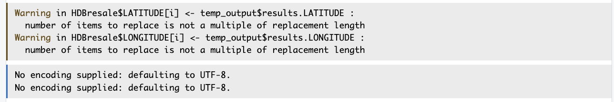
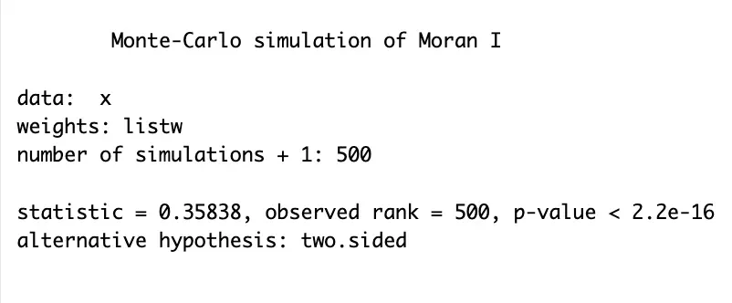
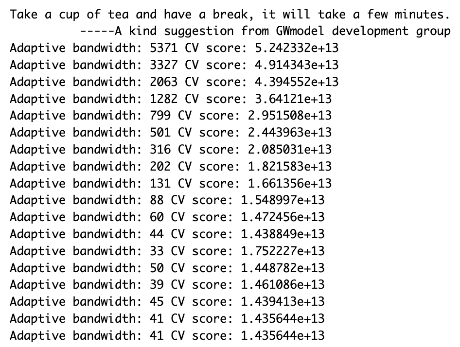
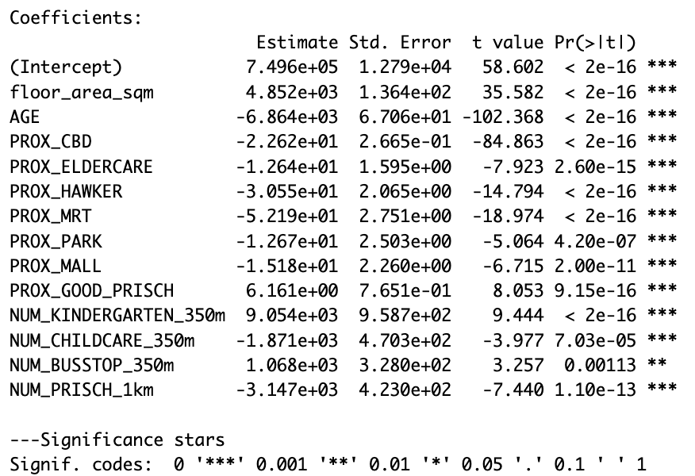
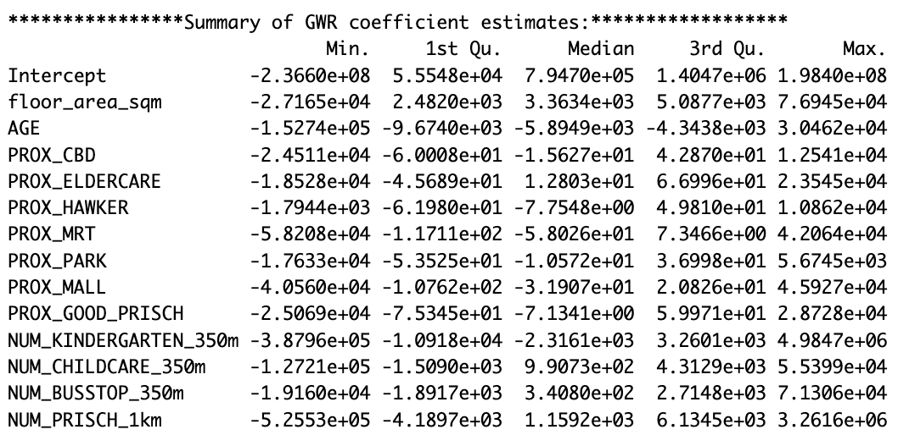

## **1** Objective

This study identifies and evaluates factors influencing HDB resale prices across Singapore during January-September 2025, with focus on understanding spatial variations in pricing mechanisms. Using Geographically Weighted Regression (GWR) on 8,679 four-room flat transactions, the analysis examines whether factors like floor area, building age, proximity to schools, MRT stations, and other amenities impact prices differently across neighborhoods, and whether spatial modeling techniques provide better explanatory power than traditional global regression.

### 1.2 Executive Summary

Analysis of 8,679 HDB resale transactions reveals significant spatial heterogeneity in pricing mechanisms across Singapore. While global regression (R² = 0.745) identifies kindergartens, building age, and floor area as key price drivers, Geographically Weighted Regression (R² = 0.951) demonstrates that factor importance varies fundamentally by location. Northern family-oriented estates prioritize childcare facilities, eastern regions value educational abundance, while central/western markets emphasize elite school access and MRT proximity. These findings suggest that HDB buyers in different neighborhoods optimize for different attributes, with direct implications for property development strategies, urban planning priorities, and investment decisions. Detailed spatial analysis reveals where specific amenities command premiums and where they add minimal value.

## **2 The Data**

Two data sets will be used in this model building exercise, they are:

-   **Aspatial dataset**:

    -   HDB Resale data: a list of HDB resale transacted prices in Singapore from Jan 2017 onwards. It is in csv format which can be downloaded from Data.gov.sg.

-   **Geospatial dataset**:

    -   *MP14_SUBZONE_WEB_PL*: a polygon feature data providing information of URA 2014 Master Plan Planning Subzone boundary data. It is in ESRI shapefile format. This data set was also downloaded from Data.gov.sg

-   **Locational factors with geographic coordinates**:

    -   Downloaded from **Data.gov.sg**.

        -   **Eldercare** data is a list of eldercare in Singapore. It is in shapefile format.

        -   **Hawker Centre** data is a list of hawker centres in Singapore. It is in geojson format.

        -   **Parks** data is a list of parks in Singapore. It is in geojson format.

        -   **Supermarket** data is a list of supermarkets in Singapore. It is in geojson format.

        -   **CHAS clinics** data is a list of CHAS clinics in Singapore. It is in geojson format.

        -   **Childcare service** data is a list of childcare services in Singapore. It is in geojson format.

        -   **Kindergartens** data is a list of kindergartens in Singapore. It is in geojson format.

    -   Downloaded from **Datamall.lta.gov.sg**.

        -   **MRT** data is a list of MRT/LRT stations in Singapore with the station names and codes. It is in shapefile format.

        -   **Bus stops** data is a list of bus stops in Singapore. It is in shapefile format.

-   **Locational factors without geographic coordinates**:

    -   Downloaded from **Data.gov.sg**.

        -   **Primary school** data is extracted from the list on General information of schools from data.gov portal. It is in csv format.

    -   Retrieved/Scraped from **other sources**

        -   **CBD** coordinates obtained from Google.

        -   **Shopping malls** data is a list of Shopping malls in Singapore obtained from [Wikipedia](https://en.wikipedia.org/wiki/List_of_shopping_malls_in_Singapore).

        -   **Good primary schools** is a list of primary schools that are ordered in ranking in terms of popularity and this can be found at [Local Salary Forum](https://www.salary.sg/2021/best-primary-schools-2021-by-popularity).

## **3 Installing and Loading R packages**

Check if R packages on package have been installed in R and if not, should installed first.

### 3.1 The Packages

In this exercise, we will use following packages:

| Package | Description |
|------------------------------|------------------------------------------|
| **sf** | Provides functions to manage, process, and manipulate Simple Features, a formal geospatial data standard for spatial geometries such as points, lines, and polygons. |
| **sfdep** | Provides functions for spatial autocorrelation analysis and spatial weights matrix computation. |
| **GWmodel** | Implements Geographically Weighted Regression and related spatial modeling techniques for capturing local variations. |
| **tmap** | Provides functions for plotting cartographic quality thematic maps with support for both static and interactive visualization. |
| **tidyverse** | A collection of R packages for data manipulation, transformation, and visualization including dplyr, ggplot2, and tidyr. |
| **gtsummary** | Creates publication-ready analytical and summary tables for regression models. |
| **performance** | Provides tools for assessing regression model quality, diagnostics, and assumption validation. |
| **corrplot** | Visualizes correlation matrices to examine relationships between variables. |
| **RColorBrewer** | Provides color palettes for data visualization and thematic mapping. |
| **httr** | Makes HTTP requests to web APIs for data retrieval and geocoding. |
| **jsonlite** | Parses JSON-formatted data from API responses. |
| **progress** | Displays progress bars for monitoring long-running operations. |

```{r}
pacman::p_load(olsrr, corrplot, ggpubr, 
               sf, sfdep, GWmodel, tmap, 
               tidyverse, gtsummary,
               performance, RColorBrewer,
               httr,jsonlite,progress,tidyverse)
```

## **4 Geospatial Data Wrangling**

### **4.1 Importing geospatial data**

The geospatial data used in this hands-on exercise is called MP14_SUBZONE_WEB_PL. It is in ESRI shapefile format. The shapefile consists of URA Master Plan 2014’s planning subzone boundaries. Polygon features are used to represent these geographic boundaries. The GIS data is in svy21 projected coordinates systems.

The code chunk below is used to import *MP_SUBZONE_WEB_PL* shapefile by using `st_read()` of **sf** packages.

```{r}
mpsz = st_read(dsn = "data/geospatial", 
               layer = "MP14_SUBZONE_WEB_PL")
```

### **4.2 Updating CRS information**

The code chunk below updates the newly imported *mpsz* with the correct ESPG code (i.e. 3414)

```{r}
mpsz_svy21 <- st_transform(mpsz, 3414)
```

After transforming the projection metadata, you can varify the projection of the newly transformed *mpsz_svy21* by using `st_crs()` of **sf** package.

The code chunk below will be used to verify the newly transformed *mpsz_svy21*.

```{r}
st_crs(mpsz_svy21)
```

Notice that the EPSG: is indicated as *3414* now.

Next, we will reveal the extent of *mpsz_svy21* by using `st_bbox()` of sf package.

```{r}
st_bbox(mpsz_svy21)
```

The print above reports the extent of mpsz_svy21 layer by its lower and upper limits.

## **5 Aspatial Data Wrangling**

### **5.2 Geocoding HDB resale data**

First on all, we download *Resale flat prices based on registration date from Jan-2017 onwards* from [Singapore’s open data portal](https://isss626-ay2025-26aug.netlify.app/in-class_ex/in-class_ex08/data.gov.sg).

### **Selecting data of interest**

This data set comprises of HDB resale transactions from Jan 2017 onwards. For the purpose of this in-class exercise, the code chunk below will be used to extract a sub-set of transaction records on 4-Room flat transacted from Janaury 2025 to September 2025.

```{r}
HDBresale <- read_csv(
  "data/aspatial/HDBResalefromJan2017onwards.csv") %>%
  filter(flat_type == "4 ROOM") %>%
  filter(month >= "2025-01" & month <= "2025-09")
```

Check is it have missing value:

```{r}
colSums(is.na(HDBresale))
```

```{r}
glimpse(HDBresale)
```

Let us prepare a geocoding function by using the code chunk below. It aims to perform the following tasks:

-   Combining the block and street name into an address. The addresses will be used to geocode instead of postal code that you learned in In-class Exercise 3b,

-   Passing the address as the **searchVal** in our query,

-   Sending the query to **OneMapSG search**. Note: Since we don’t need all the address details, we can set getAddrDetails as ‘N’,

-   Converting response (JSON object) to text,

-   Saving response in text form as a dataframe, and

-   Retain the latitude and longitude for our output.

```{r}
geocode <- function(block, streetname) {
  base_url <- "https://onemap.gov.sg/api/common/elastic/search"
  address <- paste(block, streetname, sep = " ")
  query <- list("searchVal" = address, 
                "returnGeom" = "Y",
                "getAddrDetails" = "N",
                "pageNum" = "1")
  
  res <- GET(base_url, query = query)
  restext <- content(res, as = "text")
  
  output <- fromJSON(restext)
  if (output$found == 0 || length(output$results) == 0) {
    return(data.frame(results.LATITUDE = NA, results.LONGITUDE = NA))}
  output <- output %>% 
    as.data.frame %>%
    select(results.LATITUDE, results.LONGITUDE)
  
  return(output)}
```

Next, the code chunk below will be used to to execute the geocoding function（if don't wanna run again or save time just save it and add in begin: #\| eval: false）:

```{r}
#| eval: false
HDBresale$LATITUDE <- 0
HDBresale$LONGITUDE <- 0

for (i in 1:nrow(HDBresale)){
  temp_output <- geocode(HDBresale[i, 4], HDBresale[i, 5])
  
  HDBresale$LATITUDE[i] <- temp_output$results.LATITUDE
  HDBresale$LONGITUDE[i] <- temp_output$results.LONGITUDE
}
```

Ignore the warning message as shown below.

{fig-align="center" width="553"}

For save time we save the output to rds file(remember create a new file in data file for save rds file:

```{r}
#| eval: false
saveRDS(HDBresale, "data/rds/HDBresale_geocoded.rds")
```

read rds file:

```{r}
HDBresale <- readRDS("data/rds/HDBresale_geocoded.rds")
```

Check is it really already add the end of HDBresale. After importing the data file into R, it is important for us to examine if the data file has been imported correctly.

```{r}
glimpse(HDBresale)
```

```{r}
head(HDBresale$LONGITUDE)
```

```{r}
head(HDBresale$LATITUDE)
```

check the type of LATITUDE and LONGITUDE.

```{r}
class(HDBresale$LATITUDE)
class(HDBresale$LONGITUDE)
```

Type should be numeric type, if not should change the type use the below code:

```{r}
#| eval: false
HDBresale <- HDBresale %>%
  mutate(
    LATITUDE = as.numeric(LATITUDE),
    LONGITUDE = as.numeric(LONGITUDE))

cat("LATITUDE TYPE:", class(HDBresale$LATITUDE), "\n")
cat("LONGITUDE TYPE:", class(HDBresale$LONGITUDE), "\n")
cat("Record:", nrow(HDBresale), "\n\n")

saveRDS(HDBresale, "data/rds/HDBresale_geocoded.rds")
```

Next, `summary()` of base R is used to display the summary statistics of *HDBresale* tibble data frame.

```{r}
summary(HDBresale)
```

### **5.3 Converting aspatial data frame into a sf object**

Currently, the *HDBresale* tibble data frame is aspatial. We will convert it to a **sf** object. The code chunk below converts *HDBresale* data frame into a simple feature data frame by using `st_as_sf()` of **sf** packages.

```{r}
HDBresale.sf <- st_as_sf(HDBresale,
                            coords = c("LONGITUDE", "LATITUDE"),
                            crs=4326) %>%
  st_transform(crs=3414)
```

Next, `head()` is used to list the content of *HDBresale.sf* object. Notice that the output is in point feature data frame.

```{r}
head(HDBresale.sf)
```

## 6. **Locational factors with geographic coordinates**

### 6.1 import & merge

-   Downloaded from **Data.gov.sg**.

    -   **Eldercare** data is a list of eldercare in Singapore. It is in shapefile format.

    -   **Hawker Centre** data is a list of hawker centres in Singapore. It is in geojson format.

    -   **Parks** data is a list of parks in Singapore. It is in geojson format.

    -   **Supermarket** data is a list of supermarkets in Singapore. It is in geojson format.

    -   **CHAS clinics** data is a list of CHAS clinics in Singapore. It is in geojson format.

    -   **Childcare service** data is a list of childcare services in Singapore. It is in geojson format.

    -   **Kindergartens** data is a list of kindergartens in Singapore. It is in geojson format.

-   Downloaded from **Datamall.lta.gov.sg**.

    -   **MRT** data is a list of MRT/LRT stations in Singapore with the station names and codes. It is in shapefile format.

    -   **Bus stops** data is a list of bus stops in Singapore. It is in shapefile format.mrt \<- st_read(file.path(base_path, "TrainStation_Aug2025/RapidTransitSystemStation.shp")) %\>% st_transform(3414)

go to check each file:

```{r}
kindergarten <- st_read("data/Locational_factors_with_geographic_coordinates/Kindergartens.geojson") %>% st_transform(3414)
childcare <- st_read("data/Locational_factors_with_geographic_coordinates/ChildCareServices.geojson") %>% st_transform(3414)
CHASClinics <- st_read("data/Locational_factors_with_geographic_coordinates/CHASClinics.geojson") %>% st_transform(3414)
supermarket <- st_read("data/Locational_factors_with_geographic_coordinates/SupermarketsGEOJSON.geojson") %>% st_transform(3414)
parks <- st_read("data/Locational_factors_with_geographic_coordinates/Parks.geojson") %>% st_transform(3414)
hawker <- st_read("data/Locational_factors_with_geographic_coordinates/HawkerCentresGEOJSON.geojson") %>% st_transform(3414)
eldercare <- st_read("data/Locational_factors_with_geographic_coordinates/EldercareServicesSHP/ELDERCARE.shp") %>% st_transform(3414)
busstop <- st_read("data/Locational_factors_with_geographic_coordinates/BusStopLocation_Aug2025/BusStop.shp") %>% st_transform(3414)
mrt <- st_read("data/Locational_factors_with_geographic_coordinates/MRT_Aug2025/RapidTransitSystemStation.shp") %>% st_transform(3414)
```

## **7.Locational factors without geographic coordinates**

-   **Locational factors without geographic coordinates**:

    -   Downloaded from **Data.gov.sg**.

        -   **Primary school** data is extracted from the list on General information of schools from data.gov portal. It is in csv format.

    -   Retrieved/Scraped from **other sources**

        -   **CBD** coordinates obtained from Google.

        -   **Shopping malls** data is a list of Shopping malls in Singapore obtained from [Wikipedia](https://en.wikipedia.org/wiki/List_of_shopping_malls_in_Singapore).

        -   **Good primary schools** is a list of primary schools that are ordered in ranking in terms of popularity and this can be found at [Local Salary Forum](https://www.salary.sg/2021/best-primary-schools-2021-by-popularity).

```{r}
#| eval: false
# Primary schools from data.gov portal.
primary_schools <- read_csv("data/Locational_factors_without_geographic_coordinates/Generalinformationofschools.csv")

# Shopping malls obtained from Wikipedia.
shopping_malls_list <- c(
  "Bugis Junction", "Bugis+", "Capitol Piazza", "Cathay Cineleisure Orchard",
  "The Centrepoint", "City Square Mall", "CityLink Mall", "Chinatown Point",
  "Duo", "Far East Plaza", "Funan", "Great World City", "HDB Hub",
  "Holland Village Shopping Mall", "ION Orchard", "Junction 8", "Liat Towers",
  "Lucky Plaza", "Marina Bay Sands", "Marina Bay Link Mall", "Marina Square",
  "Millenia Walk", "Mustafa Centre", "Ngee Ann City", "Orchard Central",
  "Orchard Gateway", "Palais Renaissance", "The Paragon", "People's Park Centre",
  "People's Park Complex", "Plaza Singapura", "Raffles City", "Shaw House and Centre",
  "Sim Lim Square", "The South Beach", "Square 2", "Suntec City",
  "Tanjong Pagar Centre", "Tekka Centre", "Tiong Bahru Plaza", "Thomson Plaza",
  "Novena Square Shopping Mall", "Wheelock Place", "Wisma Atria",
  "Bedok Mall", "Century Square", "Changi City Point", "Downtown East",
  "Eastpoint Mall", "Jewel Changi Airport", "Katong Shopping Centre",
  "Kallang Wave Mall", "Leisure Park Kallang", "i12 Katong", "Our Tampines Hub",
  "Parkway Parade", "Paya Lebar Quarter", "Paya Lebar Square", "Singpost Center",
  "Tampines 1", "Tampines Mall", "White Sands",
  "AMK Hub", "Canberra Plaza", "Causeway Point", "Northpoint City",
  "Sembawang Shopping Centre", "Sun Plaza",
  "Compass One", "Heartland Mall", "Hougang Mall", "NEX", "Oasis Terraces",
  "Punggol Plaza", "Punggol Coast Mall", "The Seletar Mall", "Waterway Point",
  "Woodland Mall", "Junction 10", "West Mall", "Hillion Mall", "Lot 1", 
  "Bukit Panjang Plaza", "Yee Tee Point", "VivoCity", "HarbourFront Centre", 
  "Alexandra Retail Centre", "The Clementi Mall", "Gek Poh Shopping Centre", 
  "IMM", "Jem", "Jurong Point", "Pioneer Mall", "Queensway Shopping Centre", 
  "The Rail Mall", "The Star Vista", "West Coast Plaza", "Westgate")

shopping_malls <- data.frame(
  MALL_NAME = shopping_malls_list,
  LATITUDE = NA_real_,
  LONGITUDE = NA_real_)

# Good primary schools found at Local Salary Forum.
good_primary_schools_list <- c(
  "Holy Innocents' Primary School",
  "Ai Tong School",
  "Nan Chiau Primary School",
  "Chongfu School",
  "Nanyang Primary School",
  "CHIJ Primary (Toa Payoh)",
  "Methodist Girls' School (Primary)",
  "Tao Nan School",
  "Kong Hwa School",
  "Nan Hua Primary School",
  "Catholic High School (Primary Section)",
  "Rulang Primary School",
  "CHIJ St. Nicholas Girls' School (Primary Section)",
  "Singapore Chinese Girls' Primary School",
  "St. Hilda's Primary School",
  "Anglo-Chinese School (Junior)",
  "St. Joseph's Institution Junior",
  "Fairfield Methodist School (Primary)",
  "Rosyth School",
  "Kuo Chuan Presbyterian Primary School",
  "Maris Stella High School (Primary Section)",
  "Henry Park Primary School",
  "Anglo-Chinese School (Primary)",
  "Red Swastika School",
  "Pei Chun Public School",
  "Princess Elizabeth Primary School",
  "Pei Hwa Presbyterian Primary School",
  "St. Anthony's Primary School",
  "Pasir Ris Primary School",
  "South View Primary School")

good_primary_schools <- data.frame(
  SCHOOL_NAME = good_primary_schools_list,
  LATITUDE = NA_real_,
  LONGITUDE = NA_real_)
```

Use the function to find the **geographic coordinates and** save to rds file:**：**

-   **CBD**

```{r}
#CBD coordinates obtained from Google.
cbd <- data.frame(
  name = "CBD",
  LATITUDE = 1.2802,
  LONGITUDE = 103.8563)
```

-   **Primary schools geocoding**

```{r}
#| eval: false
# Primary schools geocoding
primary_schools$LATITUDE <- 0
primary_schools$LONGITUDE <- 0
for (i in 1:nrow(primary_schools)){
  temp_output <- geocode(primary_schools$school_name[i], "")
  
  primary_schools$LATITUDE[i] <- temp_output$results.LATITUDE
  primary_schools$LONGITUDE[i] <- temp_output$results.LONGITUDE}

write_rds(primary_schools, "data/rds/primary_schools_geocoded.rds")
```

Check is it have missing value:

```{r}
#| eval: false
primary_schools %>% filter(LATITUDE == 0) %>% select(school_name)
```

next time we can just use the code below read the rds file：

```{r}
primary_schools <- read_rds("data/rds/primary_schools_geocoded.rds")
primary_schools <- primary_schools %>% mutate(across(c(LATITUDE, LONGITUDE), as.numeric))
summary(primary_schools)
```

-   **Shopping malls geocoding**

```{r}
#| eval: false
shopping_malls$LATITUDE <- 0
shopping_malls$LONGITUDE <- 0

for (i in 1:nrow(shopping_malls)){
  search_term <- paste(shopping_malls$MALL_NAME[i], "Singapore")
  temp_output <- geocode(search_term, "")
  
  shopping_malls$LATITUDE[i] <- temp_output$results.LATITUDE
  shopping_malls$LONGITUDE[i] <- temp_output$results.LONGITUDE}
```

List those can not find the LATITUDE and LONGTITUDE:

```{r}
#| eval: false
shopping_malls %>% 
  filter(is.na(LATITUDE)) %>% 
  select(MALL_NAME)
```

Fill out the missing data:

```{r}
#| eval: false
missing_malls_coords <- tribble(
  ~MALL_NAME, ~LATITUDE, ~LONGITUDE,
  "Holland Village Shopping Mall", 1.3119, 103.7959,
  "Shaw House and Centre", 1.3039, 103.8323,
  "Tekka Centre", 1.3063, 103.8509,
  "Novena Square Shopping Mall", 1.3204, 103.8436,
  "i12 Katong", 1.3151, 103.9062,
  "Heartland Mall", 1.3750, 103.8857,
  "Woodland Mall", 1.4368, 103.7860,
  "Lot 1", 1.3847, 103.7476,
  "Yee Tee Point", 1.3972, 103.7478)

shopping_malls <- shopping_malls %>%
  left_join(missing_malls_coords, by = "MALL_NAME", suffix = c("", "_manual")) %>%
  mutate(
    LATITUDE = ifelse(is.na(LATITUDE), LATITUDE_manual, LATITUDE),
    LONGITUDE = ifelse(is.na(LONGITUDE), LONGITUDE_manual, LONGITUDE)
  ) %>%
  select(MALL_NAME, LATITUDE, LONGITUDE)


shopping_malls %>% filter(is.na(LATITUDE))
write_rds(shopping_malls, "data/rds/shopping_malls_geocoded.rds")
```

```{r}
shopping_malls <- read_rds("data/rds/shopping_malls_geocoded.rds")
```

-   Good primary schools geocoding

```{r}
#| eval: false
good_primary_schools$LATITUDE <- 0
good_primary_schools$LATITUDE <- 0
good_primary_schools$LONGITUDE <- 0
for (i in 1:nrow(good_primary_schools)){
  temp_output <- geocode(good_primary_schools$SCHOOL_NAME[i], "")
  
  good_primary_schools$LATITUDE[i] <- temp_output$results.LATITUDE
  good_primary_schools$LONGITUDE[i] <- temp_output$results.LONGITUDE}
```

Check missing value:

```{r}
#| eval: false
good_primary_schools %>% filter(is.na(LATITUDE))
```

Try to find it on the primary school list:

```{r}
#| eval: false
primary_schools %>% 
  filter(grepl("Catholic High|CHIJ St. Nicholas|Maris Stella", 
               school_name, 
               ignore.case = TRUE)) %>%
  select(school_name)
```

{fig-align="center" width="480"}

Now we find out the issue: on the primary school list no fullname,is abbreviation,but primary school have no mssing value, so we find those school from primary school list:

```{r}
#| eval: false
idx_catholic <- which(good_primary_schools$SCHOOL_NAME == "Catholic High School (Primary Section)")
idx_chij <- which(good_primary_schools$SCHOOL_NAME == "CHIJ St. Nicholas Girls' School (Primary Section)")
idx_maris <- which(good_primary_schools$SCHOOL_NAME == "Maris Stella High School (Primary Section)")

good_primary_schools$LATITUDE[idx_catholic] <- as.numeric(
  primary_schools %>% filter(school_name == "CATHOLIC HIGH SCHOOL") %>% pull(LATITUDE))
good_primary_schools$LONGITUDE[idx_catholic] <- as.numeric(
  primary_schools %>% filter(school_name == "CATHOLIC HIGH SCHOOL") %>% pull(LONGITUDE))

good_primary_schools$LATITUDE[idx_chij] <- as.numeric(
  primary_schools %>% filter(school_name == "CHIJ ST. NICHOLAS GIRLS' SCHOOL") %>% pull(LATITUDE))
good_primary_schools$LONGITUDE[idx_chij] <- as.numeric(
  primary_schools %>% filter(school_name == "CHIJ ST. NICHOLAS GIRLS' SCHOOL") %>% pull(LONGITUDE))

good_primary_schools$LATITUDE[idx_maris] <- as.numeric(
  primary_schools %>% filter(school_name == "MARIS STELLA HIGH SCHOOL") %>% pull(LATITUDE))
good_primary_schools$LONGITUDE[idx_maris] <- as.numeric(
  primary_schools %>% filter(school_name == "MARIS STELLA HIGH SCHOOL") %>% pull(LONGITUDE))
good_primary_schools %>% filter(is.na(LATITUDE))
good_primary_schools <- good_primary_schools %>% mutate(across(c(LATITUDE, LONGITUDE), as.numeric))

write_rds(good_primary_schools, "data/rds/good_primary_schools_geocoded.rds")
```

Read rds file:

```{r}
good_primary_schools <- read_rds("data/rds/good_primary_schools_geocoded.rds")
summary(good_primary_schools)
```

## **8.Integrate all Locational Factors into one list and save it**

```{r}
#| eval: false
locational_factors <- list(
  kindergarten = kindergarten,
  childcare = childcare,
  CHASClinics = CHASClinics,
  supermarket = supermarket,
  parks = parks,
  hawker = hawker,
  eldercare = eldercare,
  busstop = busstop,
  mrt = mrt,
  
 
  primary_schools = primary_schools %>%
    filter(!is.na(LATITUDE) & LATITUDE != 0) %>%
    st_as_sf(coords = c("LONGITUDE", "LATITUDE"), crs = 4326) %>%
    st_transform(crs = 3414),
  
  shopping_malls = shopping_malls %>%
    filter(!is.na(LATITUDE)) %>%
    st_as_sf(coords = c("LONGITUDE", "LATITUDE"), crs = 4326) %>%
    st_transform(crs = 3414),
  
  good_primary_schools = good_primary_schools %>%
    filter(!is.na(LATITUDE)) %>%
    st_as_sf(coords = c("LONGITUDE", "LATITUDE"), crs = 4326) %>%
    st_transform(crs = 3414),
  
  cbd = cbd %>%
    st_as_sf(coords = c("LONGITUDE", "LATITUDE"), crs = 4326) %>%
    st_transform(crs = 3414))
write_rds(locational_factors, "data/rds/locational_factors_all.rds")
```

```{r}
locational_factors_all <- read_rds("data/rds/locational_factors_all.rds")
```

Check data structure and geometry type：

```{r}
for(name in names(locational_factors_all)) {
  cat(sprintf("%-25s: ", name))
  geom_types <- st_geometry_type(locational_factors_all[[name]])
  unique_types <- unique(geom_types)
  
  cat(paste(unique_types, collapse = ", "))
  cat(sprintf(" (%d records)\n", nrow(locational_factors_all[[name]])))}

```

## **9. Proximity**

```{r}
#| eval: false
mrt_coords <- data.frame(
  station_name = character(),
  x = numeric(),
  y = numeric(),
  stringsAsFactors = FALSE)

for(i in 1:nrow(locational_factors$mrt)) {
  tryCatch({
    centroid <- st_centroid(locational_factors$mrt[i,], of_largest_polygon = TRUE)
    coords <- st_coordinates(centroid)
    mrt_coords <- rbind(mrt_coords, data.frame(
      station_name = locational_factors$mrt$STN_NAM_DE[i],
      x = coords[1],
      y = coords[2]
    ))
  }, error = function(e) {
    tryCatch({
      bbox <- st_bbox(locational_factors$mrt[i,])
      mrt_coords <<- rbind(mrt_coords, data.frame(
        station_name = locational_factors$mrt$STN_NAM_DE[i],
        x = (bbox["xmin"] + bbox["xmax"]) / 2,
        y = (bbox["ymin"] + bbox["ymax"]) / 2
      ))
    }, error = function(e2) {
      cat("Skip", i, "\n")})})
  if(i %% 50 == 0) cat("processing progress:", i, "/", nrow(locational_factors$mrt), "\n")}
cat("sucessfully extracted", nrow(mrt_coords), "MRT Centrepoint\n\n")
mrt_points <- st_as_sf(mrt_coords, 
                       coords = c("x", "y"), 
                       crs = 3414)
HDBresale.sf <- HDBresale.sf %>%
  mutate(
    NUM_KINDERGARTEN_350m = lengths(st_is_within_distance(geometry, locational_factors$kindergarten, dist = 350)),
    NUM_CHILDCARE_350m = lengths(st_is_within_distance(geometry, locational_factors$childcare, dist = 350)),
    NUM_BUSSTOP_350m = lengths(st_is_within_distance(geometry, locational_factors$busstop, dist = 350)),
    NUM_PRISCH_1km = lengths(st_is_within_distance(geometry, locational_factors$primary_schools, dist = 1000)),
    
    PROX_CBD = as.numeric(st_distance(geometry, locational_factors$cbd)),
    PROX_ELDERCARE = as.numeric(apply(st_distance(geometry, locational_factors$eldercare), 1, min)),
    PROX_HAWKER = as.numeric(apply(st_distance(geometry, locational_factors$hawker), 1, min)),
    PROX_PARK = as.numeric(apply(st_distance(geometry, locational_factors$parks), 1, min)),
    PROX_GOOD_PRISCH = as.numeric(apply(st_distance(geometry, locational_factors$good_primary_schools), 1, min)),
    PROX_MALL = as.numeric(apply(st_distance(geometry, locational_factors$shopping_malls), 1, min)),
    PROX_SUPERMARKET = as.numeric(apply(st_distance(geometry, locational_factors$supermarket), 1, min)),
    PROX_MRT = as.numeric(
      st_distance(geometry,
                  mrt_points[st_nearest_feature(geometry, mrt_points), ],
                  by_element = TRUE)))

write_rds(HDBresale.sf, "data/rds/HDBresale_with_all_features.rds")
```

```{r}
HDBresale_with_all_features <- read_rds("data/rds/HDBresale_with_all_features.rds")
```

```{r}
summary(HDBresale_with_all_features$PROX_MRT)
```

## **10 Exploratory Data Analysis (EDA)**

Next,we will use statistical graphics functions of **ggplot2** package to perform EDA.

### **10.1 EDA using statistical graphics**

We can plot the distribution of *SELLING_PRICE* by using appropriate Exploratory Data Analysis (EDA) as shown in the code chunk below.

```{r}
ggplot(data=HDBresale_with_all_features, 
       aes(x=`resale_price`)) +
  geom_histogram(bins=20, 
                 color="black", 
                 fill="light blue")
```

The figure above reveals a right skewed distribution. This means that more condominium units were transacted at relative lower prices.

Statistically, the skewed dsitribution can be normalised by using log transformation. The code chunk below is used to derive a new variable called *LOG_RESALE_PRICE* by using a log transformation on the variable *RESALE_PRICE*. It is performed using `mutate()` of **dplyr** package.

```{r}
HDBresale.sf <- HDBresale_with_all_features %>%
  mutate(`LOG_RESALE_PRICE` = log(resale_price))
```

Now, we plot the *LOG_RESALE_PRICE* using the code chunk below.

```{r}
ggplot(data=HDBresale.sf, 
       aes(x=`LOG_RESALE_PRICE`)) +
  geom_histogram(bins=20, 
                 color="black", 
                 fill="light blue")
```

Notice that the distribution is relatively less skewed after the transformation.

### **10.2 Multiple Histogram Plots distribution of variables**

The code chunk below is used to create 12 histograms. Then, `ggarrange()`is used to organised these histogram into a 3 columns by 4 rows small multiple plot.

AGE = 2025 - lease_commence_date

```{r}
#| fig-width: 12
#| fig-height: 15

HDBresale.sf <- HDBresale.sf %>%
  mutate(AGE = 2025 - lease_commence_date)

FLOOR_AREA <- ggplot(data=HDBresale.sf, aes(x=floor_area_sqm)) +
  geom_histogram(bins=20, color="black", fill="light blue")

AGE <- ggplot(data=HDBresale.sf, aes(x=AGE)) +
  geom_histogram(bins=20, color="black", fill="light blue")

PROX_CBD <- ggplot(data=HDBresale.sf, aes(x=PROX_CBD)) +
  geom_histogram(bins=20, color="black", fill="light blue")

PROX_ELDERCARE <- ggplot(data=HDBresale.sf, aes(x=PROX_ELDERCARE)) +
  geom_histogram(bins=20, color="black", fill="light blue")

PROX_HAWKER <- ggplot(data=HDBresale.sf, aes(x=PROX_HAWKER)) +
  geom_histogram(bins=20, color="black", fill="light blue")

PROX_MRT <- ggplot(data=HDBresale.sf, aes(x=PROX_MRT)) +
  geom_histogram(bins=20, color="black", fill="light blue")

PROX_PARK <- ggplot(data=HDBresale.sf, aes(x=PROX_PARK)) +
  geom_histogram(bins=20, color="black", fill="light blue")

PROX_MALL <- ggplot(data=HDBresale.sf, aes(x=PROX_MALL)) +
  geom_histogram(bins=20, color="black", fill="light blue")

PROX_GOOD_PRISCH <- ggplot(data=HDBresale.sf, aes(x=PROX_GOOD_PRISCH)) +
  geom_histogram(bins=20, color="black", fill="light blue")

PROX_SUPERMARKET <- ggplot(data=HDBresale.sf, aes(x=PROX_SUPERMARKET)) +
  geom_histogram(bins=20, color="black", fill="light blue")

NUM_KINDERGARTEN_350m <- ggplot(data=HDBresale.sf, aes(x=NUM_KINDERGARTEN_350m)) +
  geom_histogram(bins=20, color="black", fill="light blue")

NUM_CHILDCARE_350m <- ggplot(data=HDBresale.sf, aes(x=NUM_CHILDCARE_350m)) +
  geom_histogram(bins=20, color="black", fill="light blue")

NUM_PRISCH_1km <- ggplot(data=HDBresale.sf, aes(x=NUM_PRISCH_1km)) +
  geom_histogram(bins=20, color="black", fill="light blue")

ggarrange(FLOOR_AREA, AGE, PROX_CBD, PROX_ELDERCARE,
          PROX_HAWKER, PROX_MRT, PROX_PARK, PROX_MALL,
          PROX_GOOD_PRISCH, PROX_SUPERMARKET, 
          NUM_KINDERGARTEN_350m, NUM_CHILDCARE_350m,NUM_PRISCH_1km,
          ncol = 3, nrow = 5 )
```

**floor_area_sqm (area) :**

-   Most 4-bedroom HDB units are between 80 and 120 square meters

-   The normal distribution is concentrated in the middle

**AGE (Building Age) :**

-   Most HDBS are between 10 and 40 years old

-   Some are very old (50 years old)

**PROX_CBD (Distance to CBD) :**

-   Most HDBS are 5,000 to 15,000 meters (5 to 15 kilometers) away from the CBD

-   Few HDBS are located near the CBD

**PROX_MRT (Distance to MRT) :**

-   Most are within the range of 500 to 1,500 meters

-   It rarely exceeds 2,000 meters (Singapore's MRT is very dense).

**NUM_KINDERGARTEN_350m:**

-   There are 0 to 5 kindergartens within a 350-meter radius around most HDBS

### **10.3 Drawing Statistical Point Map**

We want to reveal the geospatial distribution HDB resale prices in Singapore. The map will be prepared by using **tmap** package.

First, we will turn on the interactive mode of tmap by using the code chunk below.(You can use tmap_mode("view") to see each point.

```{r}
tmap_mode("plot")
```

Next, the code chunks below is used to create an interactive point symbol map.

```{r}
#| fig-width: 9
#| fig-height: 6

tm_shape(mpsz_svy21)+
  tm_polygons() +
tm_shape(HDBresale.sf) +  
  tm_dots(fill = "resale_price",
          fill_alpha = 0.6,
          size = 0.5,
          fill.scale = tm_scale_intervals(
            style="quantile")) + 
  tm_layout(
    legend.outside = TRUE,                   
    legend.outside.position = "right")        
```

Before moving on to the next section, don't forget change to plot mode avoid long time loading.

```{r}
tmap_mode("plot")
```

## 11.**Pricing Modelling in R**

In this section, you will learn how to use R-based lm() to build a hedonic pricing model for HDB resale units.

### 11.1 **Multiple Linear Regression Method**

#### 11.1.1 Visualising the relationships of the independent variables

Before building a multiple regression model, it is important to ensure that the independent variables used are not highly correlated to each other. If these highly correlated independent variables are used in building a regression model by mistake, the quality of the model will be compromised. This phenomenon is known as multicollinearity in statistics.

Correlation matrix is commonly used to visualise the relationships between the independent variables. Besides the `pairs()` function of R, there are many packages that support the display of a correlation matrix. In this section, the **corrplot** package will be used.

The code chunk below is used to plot a correlation matrix of the relationship between the independent variables in the HDB resale dataset.

```{r}
#| fig-width: 8
#| fig-height: 8
corrplot(cor(HDBresale.sf %>% 
               st_drop_geometry() %>%
               select(floor_area_sqm, AGE, PROX_CBD, PROX_ELDERCARE, 
                      PROX_HAWKER, PROX_MRT, PROX_PARK, PROX_MALL, 
                      PROX_GOOD_PRISCH, PROX_SUPERMARKET,
                      NUM_KINDERGARTEN_350m, NUM_CHILDCARE_350m, 
                      NUM_BUSSTOP_350m, NUM_PRISCH_1km)), 
         diag = FALSE, 
         order = "AOE",
         tl.pos = "td", 
         tl.cex = 0.8, 
         method = "number", 
         type = "upper")
```

Matrix reordering is very important for mining the hidden structure and pattern in the correlation matrix. There are four methods in corrplot (parameter order), named "AOE", "FPC", "hclust", and "alphabet". In the code chunk above, AOE order is used because it effectively groups highly correlated variables together by using the angular order of the eigenvectors method suggested by Michael Friendly. This ordering method is particularly useful for identifying potential multicollinearity issues, as it arranges variables such that those with similar correlation patterns are positioned adjacent to each other in the matrix, making it easier to spot problematic variable pairs.

From the correlation matrix, the highest correlation observed is between NUM_CHILDCARE_350m and NUM_BUSSTOP_350m (r = 0.47), followed by PROX_MRT and PROX_ELDERCARE (r = 0.42). However, none of these correlations exceed the commonly accepted threshold of 0.8 for severe multicollinearity concerns.

Therefore, all 14 independent variables can be retained for subsequent model building without significant multicollinearity issues. This ensures that each variable contributes unique information to the hedonic pricing model, allowing for more comprehensive analysis of factors influencing HDB resale prices.

### 11.2 **Building a HDBresale pricing model using multiple linear regression method**

The code chunk below uses `lm()` to calibrate the multiple linear regression model with all 14 independent variables identified from the correlation analysis.

```{r}
hdb.mlr <- lm(
  formula = resale_price ~ floor_area_sqm + AGE + 
    PROX_CBD + PROX_ELDERCARE + PROX_HAWKER + 
    PROX_MRT + PROX_PARK + PROX_MALL + 
    PROX_GOOD_PRISCH + PROX_SUPERMARKET +
    NUM_KINDERGARTEN_350m + NUM_CHILDCARE_350m + 
    NUM_BUSSTOP_350m + NUM_PRISCH_1km,
  data = HDBresale.sf)

summary(hdb.mlr)
```

The output report reveals that the multiple linear regression model achieves an R² of 0.7448, indicating that the model explains approximately 74.5% of the variation in HDB resale prices. The F-statistic (1806) with p-value \< 2.2e-16 suggests that the model as a whole is statistically significant.

However, examining individual coefficients shows that PROX_SUPERMARKET (p = 0.54448) is not statistically significant at the 95% confidence level. All other 13 variables are highly significant (p \< 0.001 or p \< 0.01). Given this result, we will refine the model by excluding the non-significant variable in the subsequent model calibration.

**Note：**

The code chunk above consists of two parts:

- `lm()` of Base R is used to calibrate a multiple linear regression model. The model output is stored in an lm object called *condo.mlr*.

- `summary()` is used to print the model output.

### 11.3 **Refining the Model**

With reference to the report above, it is clear that not all independent variables are statistically significant. Specifically, PROX_SUPERMARKET (p = 0.54448) fails to meet the 95% confidence threshold. We will refine the model by removing this non-significant variable while retaining the 13 statistically significant predictors.

Now, we are ready to calibrate the refined model using the code chunk below.

```{r}
hdb.mlr1 <- lm(
  formula = resale_price ~ floor_area_sqm + AGE + 
    PROX_CBD + PROX_ELDERCARE + PROX_HAWKER + 
    PROX_MRT + PROX_PARK + PROX_MALL + 
    PROX_GOOD_PRISCH + 
    NUM_KINDERGARTEN_350m + NUM_CHILDCARE_350m + 
    NUM_BUSSTOP_350m + NUM_PRISCH_1km,
  data = HDBresale.sf)

summary(hdb.mlr1)
```

The output above reveals that all explanatory variables are statistically significant at 95% confident level.

### 11.4 **Preparing Publication Quality Table: gtsummary method**

The **gtsummary** package provides an elegant and flexible way to create publication-ready summary tables in R. In the code chunk below, `tbl_regression()` is used to create a well-formatted regression report. With the gtsummary package, model statistics can be included in the report by either appending them to the report table using `add_glance_table()` or adding them as a table source note using `add_glance_source_note()` as shown in the code chunk below.

```{r}
tbl_regression(hdb.mlr1, 
               intercept = TRUE) %>% 
  add_glance_source_note(
    label = list(sigma ~ "\U03C3"),
    include = c(r.squared, adj.r.squared, 
                AIC, statistic,
                p.value, sigma))
```

### 11.5 **Regression Diagnostics**

Before applying the model, it is essential to verify that the key assumptions of multiple linear regression are satisfied. This section performs diagnostic tests to assess multicollinearity, linearity, and other potential issues that could compromise model validity.

To perform comprehensive regression diagnostics, this analysis utilizes the **performance** package, which provides a suite of tools for assessing model quality and validating regression assumptions. It is called [**olsrr**](https://olsrr.rsquaredacademy.com/). Key diagnostic capabilities include:

-   comprehensive regression output

-   residual diagnostics

-   measures of influence

-   heteroskedasticity tests

-   collinearity diagnostics

-   model fit assessment

-   variable contribution assessment

-   variable selection procedures

These diagnostics ensure that the multiple linear regression model meets the necessary assumptions for valid statistical inference.

#### 11.5.1 **Multicollinearity Test**

Multicollinearity occurs when independent variables are highly correlated with each other, making it difficult to determine the individual effect of each variable on the dependent variable. This can lead to unstable coefficient estimates and inflated standard errors.

The code chunk below uses `check_collinearity()` from the **performance** package to assess multicollinearity through Variance Inflation Factor (VIF) values.

```{r}
check_collinearity(hdb.mlr1)
```

Visualization of VIF values:

```{r}
vif_results <- check_collinearity(hdb.mlr1)
plot(vif_results) + 
  theme(axis.text.x = element_text(angle = 45, hjust = 1, size = 9)) +
  labs(y = "VIF (log-scaled)") 
```

The VIF diagnostic follows these thresholds:

-   VIF \< 5: No concern

-   VIF 5-10: Moderate concern

-   VIF \> 10: Severe multicollinearity

Since the VIF of the independent variables are less than 5. We can safely conclude that there are no sign of multicollinearity among the independent variables.

#### 11.5.2 **Linearity Test**

Multiple linear regression assumes that the relationship between the dependent variable and independent variables is linear and additive. This assumption must be verified to ensure model validity.

The code chunk below uses `check_model()` from the **performance** package to assess the linearity assumption through residual plots.

```{r}
#| eval: false
#| echo: false
check_model(hdb.mlr1, check = "linearity")
```

We can make this graph wider and easier to view by changing the value of Y-axis. (Just for reference）

```{r}
plot(fitted(hdb.mlr1), residuals(hdb.mlr1),
     xlim = c(300000, 1100000),
     xlab = "Fitted values",
     ylab = "Residuals",
     main = "Linearity",
     pch = 16,
     col = "steelblue")
abline(h = 0, lty = 2)
lines(lowess(fitted(hdb.mlr1), residuals(hdb.mlr1)), col = "green", lwd = 2)
```

The residual plot shows a slight curved pattern in the LOESS smooth line (green), suggesting some deviation from perfect linearity. The residuals exhibit a subtle U-shaped pattern, with negative residuals at lower price ranges and varying patterns at higher prices.

While this indicates that the relationship between HDB resale prices and the predictors is not perfectly linear, the deviation is relatively moderate. This non-linearity may be attributed to the spatial heterogeneity in pricing mechanisms across different locations in Singapore, which motivates the use of Geographically Weighted Regression (GWR) in subsequent analysis. GWR is designed to capture such local variations and non-stationary relationships that a global linear model cannot fully address.

#### 11.5.3 Test for Normality Assumption

The normality assumption requires that the model's residuals are normally distributed. This is important for the validity of hypothesis tests and confidence intervals. Visual methods such as Q-Q plots and statistical tests like the Shapiro-Wilk test are commonly used to assess this assumption.

The code chunk below uses `check_normality()` from the **performance** package to test the normality assumption.

```{r}
check_normality(hdb.mlr1)
```

The print above reveals that the p-value of the normality assumption test is less than alpha value of 0.05. Hence we reject the normality assumption at 95% confident level.

The statistical test result indicates whether the residuals deviate significantly from normality. However, it is important to note that formal normality tests like Shapiro-Wilk are highly sensitive to large sample sizes and often yield significant results even for minor deviations. Visual inspection through Q-Q plots is generally more informative for assessing practical significance. The Q-Q plot below provides a visual assessment of normality:

```{r}
qqnorm(residuals(hdb.mlr1), main = "Normal Q-Q Plot")
qqline(residuals(hdb.mlr1), col = "blue")
```

The Q-Q plot above shows that the majority of data points fall along the diagonal reference line, indicating that the residuals largely follow a normal distribution. The deviations at both tails suggest a slightly heavy-tailed distribution, which is common in large datasets with some extreme values.

Alternatively, `check_model()` from the **performance** package can be used for a comprehensive visual assessment of multiple model assumptions simultaneously, as shown in the code chunk below.

```{r}
check_model(hdb.mlr1,
            check= "normality")
```

The figure reveals that the residual of the multiple linear regression model (i.e. hdb.mlr1) is resemble normal distribution.

## 12.**Testing for Spatial Autocorrelation**

Since the hedonic model uses geographically referenced data, it is essential to test for spatial autocorrelation in the residuals. Traditional OLS regression assumes that observations are independent, but spatial data often violates this assumption due to the presence of spatial dependence.

Spatial autocorrelation occurs when a variable is correlated with itself across different spatial locations. This phenomenon is grounded in Tobler's First Law of Geography: "Everything is related to everything else, but nearby things are more related than distant things." In the context of housing prices, properties located near each other tend to have similar prices due to shared neighborhood characteristics, accessibility, and amenities.

Ignoring spatial autocorrelation in a regression model can lead to serious statistical issues:

-   **Biased and inefficient coefficient estimates**: If autocorrelation is present, standard errors of the model coefficients can be wrong, leading to unreliable hypothesis tests (p-values). The model might appear more significant than it is.

-   **Misleading significance tests**: Standard regression models cannot distinguish between true explanatory power and the influence of spatial patterns, resulting in inaccurate p-values.

-   **Model misspecification**: Significant spatial autocorrelation in the regression residuals often signals that important explanatory variables are missing from the model. The spatial patterning of the residuals (over- and under-predictions) can provide clues about what these missing variables might be.

-   **Inflated Type I error rates**: Researchers might incorrectly reject a true null.

To test for spatial autocorrelation, Moran's I test is performed on the model residuals. Significant spatial autocorrelation in the residuals indicates that the OLS model fails to capture the full spatial structure of the data, providing justification for using Geographically Weighted Regression (GWR).

First, extract the residuals from the multiple linear regression model:

```{r}
mlr.output <- as.data.frame(hdb.mlr1$residuals)
```

Secondly, join the residuals with the spatial data frame:

```{r}
hdb_resale.res <- cbind(HDBresale.sf, hdb.mlr1$residuals) %>%
  rename(MLR_RES = `hdb.mlr1.residuals`)
```

Visualize the spatial distribution of residuals:

```{r}
tmap_mode("plot")

tm_shape(mpsz_svy21) +
  tm_polygons(fill_alpha = 0.4) +
tm_shape(hdb_resale.res) +  
  tm_dots(
    fill = "MLR_RES",
    size = 0.5,
    col = "black",
    fill.scale = tm_scale(
      n = 10,
      values = rev(brewer.pal(11, "RdBu")),
      style = "quantile",
      midpoint = NA),
    fill.legend = tm_legend(title = "Residuals")
  ) + 
  tm_title("MLR Residuals (Quantile Classification)") +
  tm_layout(legend.outside = TRUE) +
  tm_view(set_zoom_limits = c(11,14))
```

The map reveals spatial clustering of residuals, suggesting potential spatial autocorrelation. Compute distance-based spatial weights:

```{r}
hdb_resale.res <- hdb_resale.res %>% 
  mutate(
    nb = st_dist_band(st_geometry(geometry), upper = 1500),
    wt = st_weights(nb, style = "W"),
    .before = 1)
```

Perform Moran's I test:

```{r}
#| eval: false
set.seed(1234)
global_moran_perm(
  hdb_resale.res$MLR_RES, 
  nb = hdb_resale.res$nb, 
  wt = hdb_resale.res$wt,
  alternative = "two.sided", 
  nsim = 499)
```

{fig-align="center" width="447"}

The Global Moran's I test yields a statistic of 0.35838 (p \< 2.2e-16), rejecting the null hypothesis of random distribution. The positive Moran's I value indicates strong spatial clustering of residuals, confirming that the OLS model fails to capture spatial dependencies in HDB pricing. This justifies the use of GWR to account for spatial non-stationarity.

## **13 Building** explanatory **Models using GWmodel**

### **13.1 Building Adaptive Bandwidth GWR Model**

#### 13.1.1 Computing the adaptive bandwidth

We will first use `bw.gwr()` to determine the recommended data point to use.

The code chunk used look very similar to the one used to compute the fixed bandwidth except the `adaptive` argument has changed to **TRUE**. And for save time we save to rds file：

```{r}
#| eval: false
bw.adaptive <- bw.gwr(
  formula = resale_price ~ floor_area_sqm + AGE  + 
    PROX_CBD + PROX_ELDERCARE + PROX_HAWKER    +
    PROX_MRT + PROX_PARK + PROX_MALL + 
    PROX_GOOD_PRISCH + 
    NUM_KINDERGARTEN_350m + NUM_CHILDCARE_350m +
    NUM_BUSSTOP_350m + NUM_PRISCH_1km, 
  data=HDBresale.sf, 
  approach="CV", 
  kernel="gaussian", 
  adaptive=TRUE, 
  longlat=FALSE)

saveRDS(bw.adaptive, "data/rds/bw_adaptive.rds")
```

{fig-align="center" width="426"}

The result shows that the 41 is the recommended data points to be used.

Next,we can read the rds file for following work:

```{r}
bw.adaptive <- readRDS("data/rds/bw_adaptive.rds")
```

#### 13.1.2 Constructing the adaptive bandwidth gwr model

Now, we can go ahead to calibrate the gwr-based explanatory hdbmodel by using adaptive bandwidth and gaussian kernel as shown in the code chunk below.

```{r}
#| eval: false
gwr.adaptive <- gwr.basic(
  formula = resale_price ~ floor_area_sqm + AGE  + 
    PROX_CBD + PROX_ELDERCARE + PROX_HAWKER    +
    PROX_MRT + PROX_PARK + PROX_MALL + 
    PROX_GOOD_PRISCH + 
    NUM_KINDERGARTEN_350m + NUM_CHILDCARE_350m + NUM_BUSSTOP_350m + NUM_PRISCH_1km, 
  data=HDBresale.sf, 
  bw=bw.adaptive, 
  kernel = 'gaussian', 
  adaptive=TRUE, 
  longlat = FALSE)
saveRDS(gwr.adaptive, "data/rds/gwr_adaptive.rds")
```

```{r}
gwr.adaptive <- readRDS("data/rds/gwr_adaptive.rds")
```

The code below can be used to display the model output.

```{r}
gwr.adaptive
```

**Model Performance Comparison**

1.  **Multiple Linear Regression (Global Model):**

-   R² = 0.745

-   AIC = 220,873

2.  **Geographically Weighted Regression (Local Model):**

-   R² = 0.951

-   AIC = 207,547

-   Optimal bandwidth: 41 neighbors

**Improvement**:

The GWR model demonstrates substantial improvement over the global regression model, with R² increasing from 0.745 to 0.951 (+27.6%) and AIC decreasing by 13,326 points. This confirms significant spatial heterogeneity in HDB pricing mechanisms across Singapore, validating the need for spatially adaptive modeling.

#### 13.1.3 **Visualising GWR Output**

In addition to regression residuals, the output feature class table includes fields for observed and predicted y values, condition number (cond), Local R2, residuals, and explanatory variable coefficients and standard errors:

-   Condition Number: this diagnostic evaluates local collinearity. In the presence of strong local collinearity, results become unstable. Results associated with condition numbers larger than 30, may be unreliable.

-   Local R2: these values range between 0.0 and 1.0 and indicate how well the local regression model fits observed y values. Very low values indicate the local model is performing poorly. Mapping the Local R2 values to see where GWR predicts well and where it predicts poorly may provide clues about important variables that may be missing from the regression model.

-   Predicted: these are the estimated (or fitted) y values 3. computed by GWR.

-   Residuals: to obtain the residual values, the fitted y values are subtracted from the observed y values. Standardized residuals have a mean of zero and a standard deviation of 1. A cold-to-hot rendered map of standardized residuals can be produce by using these values.

-   Coefficient Standard Error: these values measure the reliability of each coefficient estimate. Confidence in those estimates are higher when standard errors are small in relation to the actual coefficient values. Large standard errors may indicate problems with local collinearity.

They are all stored in a SpatialPointsDataFrame or SpatialPolygonsDataFrame object integrated with fit.points, GWR coefficient estimates, y value, predicted values, coefficient standard errors and t-values in its “data” slot in an object called **SDF** of the output list.

#### **13.1.4 Converting SDF into *sf* data.frame**

To visualise the fields in **SDF**, we need to first covert it into **sf** data.frame by using the code chunk below.

```{r}
HDBresale.sf.adaptive <-
  st_as_sf(gwr.adaptive$SDF) %>%
  st_transform(crs=3414)
```

Next, `glimpse()` is used to display the content of ***HDBresale.sf.adaptive*** sf data frame.

```{r}
glimpse(HDBresale.sf.adaptive)
```

```{r}
summary(gwr.adaptive$SDF$yhat)
```

The GWR model predicts HDB prices ranging from \$399k to \$1.39M (mean: \$672k). Compared to actual prices (\$338k-\$1.06M), the model tends to overpredict at the upper end, with the maximum predicted value exceeding the actual maximum by approximately \$330k. This suggests the model may be overestimating prices for premium units, indicating potential areas for model refinement.

#### **13.1.5 Visualising local R2**

The Local R² map reveals substantial spatial variation in model performance across Singapore.

```{r}
summary(HDBresale.sf.adaptive$Local_R2)
```

The code chunks below is used to create an interactive point symbol map.

```{r}
tmap_mode("plot")
tm_shape(mpsz_svy21)+
  tm_polygons(fill_alpha = 0.1) +
tm_shape(HDBresale.sf.adaptive) +  
  tm_dots(col = "Local_R2",
          border.col = "gray60",
          border.lwd = 1) +
  tm_view(set_zoom_limits = c(11,14))
```

The Local R² map reveals that the GWR model performs well across Singapore, with most locations showing R² values exceeding 0.8, indicating strong local model fit throughout the study area.

#### 13.1.6 **Visualising coefficient estimates**

```{r}
summary(HDBresale.sf.adaptive$floor_area_sqm_SE)
summary(HDBresale.sf.adaptive$floor_area_sqm_TV)
```

The code chunks below is used to create an interactive point symbol map. If you want the interactive mode, change "plot" to "view".

```{r}
tmap_mode("plot")
floor_area_sqm_SE <- tm_shape(mpsz_svy21) +
  tm_polygons(alpha = 0.1) +
tm_shape(HDBresale.sf.adaptive) +  
  tm_dots(
    col = "floor_area_sqm_SE",
    palette = "YlOrRd",
    style = "quantile",     
    n = 5,
    border.col = "gray60",
    border.lwd = 0.5,
    size = 0.5,
    title = "SE") +
  tm_view(set.zoom.limits = c(11,14))

floor_area_sqm_TV <- tm_shape(mpsz_svy21) +
  tm_polygons(alpha = 0.1) +
tm_shape(HDBresale.sf.adaptive) +  
  tm_dots(
    col = "floor_area_sqm_TV",
    palette = "YlOrRd",      
    style = "quantile",       
    n = 7,                    
    border.col = "gray60",
    border.lwd = 0.5,
    size = 0.5,
    title = "t-value")

tmap_arrange(floor_area_sqm_SE, floor_area_sqm_TV, 
             asp = 1, ncol = 2, sync = TRUE)
```

Floor area sqm is more important in downtown areas, but its significance decreases further away from the downtown core.

## 14. Spatial Variation in Coefficient Estimates

### 14.1 Key Factors Influencing HDB Resale Prices

The global regression results (bottom table) reveal which factors significantly affect HDB prices across Singapore:

{fig-align="center" width="487"}

**Top 5 Most Influential Factors:**

1.  **NUM_KINDERGARTEN_350m** (+9,054): Each kindergarten within 350m adds \$9,054
    -   Reflects strong family-oriented buyer demand
2.  **AGE** (-6,864): Each year older reduces price by \$6,864
    -   Building depreciation is a major pricing factor
3.  **floor_area_sqm** (+4,852): Each sqm adds \$4,852
    -   Space is highly valued across Singapore
4.  **PROX_MRT** (-52): Each meter from MRT reduces \$52
    -   Transport accessibility matters significantly
5.  **NUM_PRISCH_1km** (-3,147): More primary schools nearby reduces price
    -   May reflect overcrowding or competition concerns

**Other significant factors:** PROX_HAWKER (-31), PROX_CBD (-22), PROX_MALL (-15)

All factors are highly significant (p \< 2e-16).

### 14.2 Spatial Heterogeneity: Do These Effects Vary by Location?

While these factors are important globally, the GWR coefficient summary reveals their influence varies dramatically across Singapore:

{fig-align="center" width="539"}

**Variables with Largest Spatial Variation:**

1.  **NUM_KINDERGARTEN_350m** (Range: -387,960 to 4,984,700)
    -   Highly valued in family estates, irrelevant or negative in areas with elderly residents or young professionals
2.  **NUM_PRISCH_1km** (Range: -525,530 to 3,261,600)
    -   Dramatic differences reflect varying education priorities and school quality perceptions across neighborhoods
3.  **AGE** (Range: -152,740 to 30,462)
    -   Stronger depreciation in mature estates; some newer developments show positive age effects (heritage value)
4.  **PROX_MRT** (Range: -58,208 to 42,064)
    -   Effects differ by car ownership rates and public transport dependency
5.  **floor_area_sqm** (Range: -27,165 to 76,945)
    -   Premium in dense urban areas; negative where maintenance costs outweigh space benefits

**Key Insight:** The wide coefficient ranges confirm spatial non-stationarity, the same factor can have opposite effects in different locations. This validates the use of GWR over global regression.

## 14.3 Spatial Distribution of Key Coefficients

### 14.3.1 NUM_KINDERGARTEN_350m

```{r}
tmap_mode("plot")

kindergarten_coef <- tm_shape(mpsz_svy21) +
  tm_polygons(alpha = 0.1) +
tm_shape(HDBresale.sf.adaptive) +  
  tm_dots(
    col = "NUM_KINDERGARTEN_350m",
    palette = "YlOrRd",
    style = "quantile",
    n = 6,
    size = 0.2,
    alpha = 0.7,
    border.col = NA,
    title = "Coefficient") +
  tm_layout(
    main.title = "NUM_KINDERGARTEN_350m Coefficient",
    main.title.size = 1.2,
    legend.position = c("right", "bottom"), 
    legend.title.size = 0.8,
    legend.text.size = 0.7,
    legend.bg.color = "white",
    legend.bg.alpha = 0.8,
    frame = TRUE)

kindergarten_coef
```

Kindergarten density is most important in the northern and northeastern estates (dark red). Here, each new kindergarten adds more than \$6,000 to the HDB prices. These new towns are designed with families in mind and are home to many young families. By contrast, central show lower coefficients (yellow).

### 14.3.2 AGE

```{r}
tmap_mode("plot")

age_coef <- tm_shape(mpsz_svy21) +
  tm_polygons(alpha = 0.1) +
tm_shape(HDBresale.sf.adaptive) +  
  tm_dots(
    col = "AGE",
    palette = "YlOrRd",
    style = "quantile",
    n = 6,
    size = 0.2,
    alpha = 0.7,
    border.col = NA,
    title = "Coefficient") +
  tm_layout(
    main.title = "AGE Coefficient",
    main.title.size = 1.2,
    legend.position = c("right", "bottom"), 
    legend.title.size = 0.8,
    legend.text.size = 0.7,
    legend.bg.color = "white",
    legend.bg.alpha = 0.8,
    frame = TRUE)

age_coef
```

The effect of building depreciation is strongest in western and northern estates (dark red). In contrast, central and southeastern regions show weaker depreciation (yellow/light orange), suggesting that location advantages decrease age-related decline in these established neighborhoods.

### 14.3.3 floor_area_sqm

```{r}
tmap_mode("plot")

area_coef <- tm_shape(mpsz_svy21) +
  tm_polygons(alpha = 0.1) +
tm_shape(HDBresale.sf.adaptive) +  
  tm_dots(
    col = "floor_area_sqm",
    palette = "YlOrRd",
    style = "quantile",
    n = 6,
    size = 0.2,
    alpha = 0.7,
    border.col = NA,
    title = "Coefficient") +
  tm_layout(
    main.title = "floor_area_sqm Coefficient",
    main.title.size = 1.2,
    legend.position = c("right", "bottom"), 
    legend.title.size = 0.8,
    legend.text.size = 0.7,
    legend.bg.color = "white",
    legend.bg.alpha = 0.8,
    frame = TRUE)

area_coef
```

The floor area coefficients are highest in central and eastern estates (dark red: up to \$76,000 per sqm) and lowest in west-north regions (yellow: \$2,000-3,000 per sqm).

**Note**:

These differences in prices may show that people value space differently in different places, but they could also be affected by how houses are built. Town centres may have a wider range of house sizes, while new housing estates may have houses all built to the same plan. The differences in the coefficients need to be understood in relation to the local housing market.

### 14.3.4 NUM_PRISCH_1km

```{r}
tmap_mode("plot")

prisch_coef <- tm_shape(mpsz_svy21) +
  tm_polygons(alpha = 0.1) +
tm_shape(HDBresale.sf.adaptive) +  
  tm_dots(
    col = "NUM_PRISCH_1km",
    palette = "YlOrRd",
    style = "quantile",
    n = 6,
    size = 0.2,
    alpha = 0.7,
    border.col = NA,
    title = "Coefficient") +
  tm_layout(
    main.title = "NUM_PRISCH_1km Coefficient",
    main.title.size = 1.2,
    legend.position = c("right", "bottom"), 
    legend.title.size = 0.8,
    legend.text.size = 0.7,
    legend.bg.color = "white",
    legend.bg.alpha = 0.8,
    frame = TRUE)

prisch_coef
```

```{r}
tmap_mode("plot")

prisch_coef <- tm_shape(mpsz_svy21) +
  tm_polygons(alpha = 0.1) +
tm_shape(HDBresale.sf.adaptive) +  
  tm_dots(
    col = "NUM_PRISCH_1km",
    palette = "YlOrRd",      
    style = "quantile",
    n = 6,
    size = 0.2,
    alpha = 0.7,
    border.col = NA,
    title = "Coefficient"
  ) +
  tm_layout(
    main.title = "NUM_PRISCH_1km Coefficient",
    main.title.size = 1.2,
    legend.position = c("right", "bottom"), 
    legend.title.size = 0.6,
    legend.text.size = 0.5,
    legend.bg.color = "white",
    legend.bg.alpha = 0.8,
    frame = TRUE
  )

good_prisch_coef <- tm_shape(mpsz_svy21) +
  tm_polygons(alpha = 0.1) +
tm_shape(HDBresale.sf.adaptive) +  
  tm_dots(
    col = "PROX_GOOD_PRISCH",
    palette = "-YlOrRd",      
    style = "quantile",
    n = 6,
    size = 0.2,
    alpha = 0.7,
    border.col = NA,
    title = "Coefficient"
  ) +
  tm_layout(
    main.title = "PROX_GOOD_PRISCH Coefficient",
    main.title.size = 1.2,
    legend.position = c("right", "bottom"), 
    legend.title.size = 0.6,
    legend.text.size = 0.5,
    legend.bg.color = "white",
    legend.bg.alpha = 0.8,
    frame = TRUE
  )

tmap_arrange(prisch_coef, good_prisch_coef, 
             asp = 1, ncol = 2, sync = TRUE)
```

**Eastern market segments** (dark red on left, yellow on right) place premium value on educational diversity. Properties with multiple school options within 1km capture significantly higher prices, reflecting buyer demand for choice and accessibility. Elite school proximity adds minimal value in these areas—buyers optimize for resource abundance rather than institutional prestige.

**Central and western markets** show opposite pricing dynamics (yellow-orange on left, dark red on right). High school density can depress values (likely due to overcrowding perceptions), while elite school access drives substantial price premiums. Properties near top-tier institutions command markups that justify premium positioning, demonstrating strong willingness-to-pay for educational brand value.

**Note on Color Scheme:**

The color palettes are reversed between the two maps to ensure consistent interpretation:

-   **NUM_PRISCH_1km** uses standard palette (red = high positive coefficients) because more schools = higher prices in these areas
-   **PROX_GOOD_PRISCH** uses reversed palette (red = high negative coefficients) because shorter distance = higher prices in these areas

This ensures that **dark red consistently indicates high importance** across both maps, making spatial patterns directly comparable despite the different variable types (count vs. distance).

### 14.3.5 PROX_MRT

```{r}
tmap_mode("plot")

mrt_coef <- tm_shape(mpsz_svy21) +
  tm_polygons(alpha = 0.1) +
tm_shape(HDBresale.sf.adaptive) +  
  tm_dots(
    col = "PROX_MRT",
    palette = "-YlOrRd",
    style = "quantile",
    n = 6,
    size = 0.2,
    alpha = 0.7,
    border.col = NA,
    title = "Coefficient") +
  tm_layout(
    main.title = "PROX_MRT Coefficient",
    main.title.size = 1.2,
    legend.position = c("right", "bottom"), 
    legend.title.size = 0.8,
    legend.text.size = 0.7,
    legend.bg.color = "white",
    legend.bg.alpha = 0.8,
    frame = TRUE)

mrt_coef
```

**Central and southeastern markets** (dark red: coefficients -\$58,208 to -\$159 per meter) show the strongest public transport dependency. MRT proximity commands substantial premiums in these mature, high-density areas where car-lite residents rely heavily on public transit. Properties within walking distance of stations capture significant accessibility value.

**Northern and western regions** (yellow: minimal to positive coefficients) demonstrate limited MRT proximity effects. Higher car ownership rates in these developing estates mean buyers prioritize other amenities over station distance. Additionally, comprehensive MRT coverage in newer towns reduces the marginal value of being close to any single station when all properties have good access, proximity premium diminishes.

## References

### Data Sources

**Singapore Government Open Data:**

-   Data.gov.sg (2025). *HDB Resale Flat Prices*. Available at: <https://data.gov.sg/datasets/d_8b84c4ee58e3cfc0ece0d773c8ca6abc/view>

-   Data.gov.sg (2025). *Master Plan 2014 Subzone Boundary (Web)*. Available at: <https://data.gov.sg/datasets/d_d14da225fccf921049ab64238ff473d9/view>

-   Data.gov.sg (2025). *General Information of Schools*. Available at: <https://data.gov.sg/datasets/d_688b934f82c1059ed0a6993d2a829089/view>

-   Data.gov.sg (2025). *Eldercare Services*. Available at: <https://data.gov.sg/datasets/d_05279cf0148aadc5172ا462c28e0831ac/view>

-   Data.gov.sg (2025). *Hawker Centres*. Available at: <https://data.gov.sg/datasets/d_4a086da0a5553be1d89383cd90d07ecd/view>

-   Data.gov.sg (2025). *Parks*. Available at: <https://data.gov.sg/datasets/d_26071c850e144a8ba5160114c437d0c4/view>

-   Data.gov.sg (2025). *Supermarkets*. Available at: <https://data.gov.sg/datasets/d_4a086da0a5553be1d89383cd90d07ecd/view>

-   Data.gov.sg (2025). *CHAS Clinics*. Available at: <https://data.gov.sg/datasets/d_4762807ea792ffbc5dcf4d7d09290e5f/view>

-   Data.gov.sg (2025). *Child Care Services*. Available at: <https://data.gov.sg/datasets/d_5835d718fbf67e2d45c914fc339e53d3/view>

-   Data.gov.sg (2025). *Kindergartens*. Available at: <https://data.gov.sg/datasets/d_cc1c40bcf1b8fa9bef5ff6e1c7eb6afe/view>

**LTA DataMall:**

-   LTA DataMall (2025). *Train Station*. Available at: <https://datamall.lta.gov.sg/content/datamall/en/static-data.html>

-   LTA DataMall (2025). *Bus Stops*. Available at: <https://datamall.lta.gov.sg/content/datamall/en/static-data.html>

**Other Sources:**

-   Wikipedia (2025). *List of Shopping Malls in Singapore*. Available at: <https://en.wikipedia.org/wiki/List_of_shopping_malls_in_Singapore>

-   Local Salary Forum (2021). *Best Primary Schools 2021 by Popularity*. Available at: <https://www.salary.sg/2021/best-primary-schools-2021-by-popularity>

-   OneMap API (2025). *Singapore Land Authority OneMap API*. Available at: <https://www.onemap.gov.sg/apidocs/>

### R Packages

-   Pebesma, E. (2018). Simple Features for R: Standardized Support for Spatial Vector Data. *The R Journal*, 10(1), 439-446. <https://cran.r-project.org/package=sf>

-   Josiah Parry, Hadley Wickham (2023). sfdep: Spatial Dependence for Simple Features. <https://cran.r-project.org/package=sfdep>

-   Gollini, I., Lu, B., Charlton, M., Brunsdon, C., & Harris, P. (2015). GWmodel: An R Package for Exploring Spatial Heterogeneity Using Geographically Weighted Models. *Journal of Statistical Software*, 63(17), 1-50. <https://cran.r-project.org/package=GWmodel>

-   Tennekes, M. (2018). tmap: Thematic Maps in R. *Journal of Statistical Software*, 84(6), 1-39. <https://cran.r-project.org/package=tmap>

-   Wickham, H., et al. (2019). Welcome to the tidyverse. *Journal of Open Source Software*, 4(43), 1686. <https://www.tidyverse.org/>

-   Sjoberg, D. D., et al. (2021). Reproducible Summary Tables with the gtsummary Package. *The R Journal*, 13(1), 570-580. <https://cran.r-project.org/package=gtsummary>

-   Lüdecke, D., et al. (2021). performance: An R Package for Assessment, Comparison and Testing of Statistical Models. *Journal of Open Source Software*, 6(60), 3139. <https://cran.r-project.org/package=performance>

-   Wei, T. and Simko, V. (2021). corrplot: Visualization of a Correlation Matrix. <https://cran.r-project.org/package=corrplot>

-   Kassambara, A. (2023). ggpubr: 'ggplot2' Based Publication Ready Plots. <https://cran.r-project.org/package=ggpubr>

-   Neuwirth, E. (2022). RColorBrewer: ColorBrewer Palettes. <https://cran.r-project.org/package=RColorBrewer>

-   Wickham, H. (2020). httr: Tools for Working with URLs and HTTP. <https://cran.r-project.org/package=httr>

-   Ooms, J. (2014). The jsonlite Package: A Practical and Consistent Mapping Between JSON Data and R Objects. <https://cran.r-project.org/package=jsonlite>

### Methodology References

-   Fotheringham, A. S., Brunsdon, C., & Charlton, M. (2002). *Geographically Weighted Regression: The Analysis of Spatially Varying Relationships*. John Wiley & Sons.

-   Tobler, W. R. (1970). A Computer Movie Simulating Urban Growth in the Detroit Region. *Economic Geography*, 46(sup1), 234-240.

-   Anselin, L. (1995). Local Indicators of Spatial Association—LISA. *Geographical Analysis*, 27(2), 93-115.

-   Prof.KAM <https://isss626-ay2025-26aug.netlify.app>
